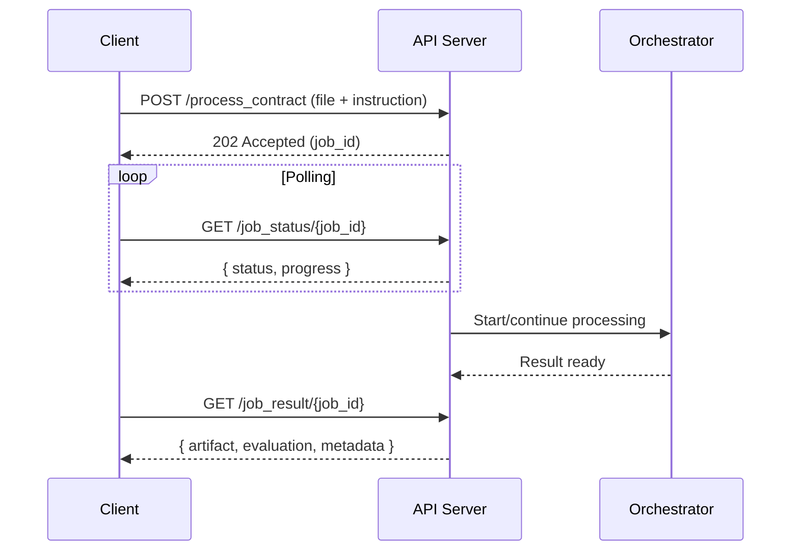

# API Integration Guide (Conceptual)

This guide describes the conceptual API surface for the Contract-Agent microservice to support client integration. It avoids implementation details and hardcoded values, focusing on lifecycle, states, and integration patterns.

## Principles

- Configurable base URL and authentication; do not hardcode endpoints or credentials.
- Predictable, machine-readable responses for automation.
- Large-document awareness (payload sizes, timeouts, polling).
- Backward-compatible evolution via versioning and capability flags.

## Endpoint Overview (Conceptual)

- `GET {BASE_URL}/health`
  - Purpose: Liveness/readiness and dependency health.
  - Response: Component state, queue size, and provider connectivity signals.

- `POST {BASE_URL}/process_contract`
  - Purpose: Submit a contract-processing job.
  - Request: Multipart form-data
    - `file`: contract file (PDF/RTF/TXT)
    - `instruction`: textual instructions for modifications
    - Optional knobs (as fields or JSON blob): quality thresholds, chunking preferences, priority
  - Response (202 Accepted): `{ "job_id": "...", "status": "queued" }`

- `GET {BASE_URL}/job_status/{job_id}`
  - Purpose: Poll job progress and current state.
  - Response: `{ "job_id": "...", "status": "queued|processing|evaluating|completed|failed", "progress": 0..100, "metrics": { ... }, "updated_at": "ISO-8601" }`

- `GET {BASE_URL}/job_result/{job_id}`
  - Purpose: Retrieve final artifact and evaluation summary.
  - Response (200 OK on success):
    - `artifact`: modified contract (RTF) or download link
    - `evaluation`: JSON per Evaluation Methodology
    - `metadata`: job timing, model policy, chunking summary
  - Response (4xx/5xx on failures): standard error envelope (see below)

Notes:
- Base URL, authentication method, and transport security are environment-specific.
- Response bodies may include additional non-breaking fields over time.

## Standard Error Envelope

All error responses adopt a consistent shape to simplify handling:

```json
{
  "success": false,
  "error": "human-readable message",
  "code": "MACHINE_CODE",
  "details": { "context": "optional structured diagnostics" }
}
```

- `code` is stable and documented; messages may change without notice.
- `details` is optional and intended for troubleshooting.

## Job Lifecycle and States

1. Submit job → `202 Accepted` with `job_id`.
2. States: `queued` → `processing` (actor steps and possibly chunking) → `evaluating` (critic) → `completed` or `failed`.
3. Clients poll `job_status` with bounded backoff (e.g., exponential with max interval) to avoid thundering herd.
4. Results retrieval MAY trigger server-side cleanup depending on environment policy.

## Requests and Responses (Conceptual Examples)

- Submit request (multipart):

```
POST {BASE_URL}/process_contract
Content-Type: multipart/form-data; boundary=...

--boundary
Content-Disposition: form-data; name="file"; filename="contract.rtf"
Content-Type: application/rtf

<binary>
--boundary
Content-Disposition: form-data; name="instruction"

Change governing law to ... ; replace counterparty A with B.
--boundary--
```

- Status response example:

```json
{
  "job_id": "abc123",
  "status": "evaluating",
  "progress": 78,
  "metrics": { "chunks": 12, "changed_chunks": 7 },
  "updated_at": "2025-09-24T08:44:52Z"
}
```

- Result response example (success):

```json
{
  "artifact": "<RTF CONTENT OR PRESIGNED URL>",
  "evaluation": { /* see Evaluation Methodology JSON */ },
  "metadata": {
    "job_id": "abc123",
    "duration_ms": 52344,
    "model_policy": "primary:fine-grained-legal; fallback:general-large",
    "chunking": { "enabled": true, "total": 12, "changed": 7 }
  }
}
```

## Versioning and Compatibility

- Version the API via header or path (e.g., `Accept: application/vnd.contract-agent.v1+json`).
- Additive, backward-compatible changes preferred; use capability flags to advertise optional features.
- Breaking changes require a new major version and deprecation policy.

## Rate Limits, Timeouts, and Sizes

- Enforce request size caps suitable for large documents; document current limits in environment configs.
- Recommend client timeouts that account for long-running processing.
- Apply server-side concurrency controls; communicate `429 Too Many Requests` with `Retry-After` when applicable.

## Security and Privacy (Conceptual)

- Transport security (TLS) is required.
- Authentication/authorization are environment-specific (token-based or federated); avoid embedding secrets in clients.
- PII and confidential data handling must follow org policy (retention, redaction, access controls).
- Logs exclude sensitive payloads by default; diagnostic verbosity is gated.

## Client Integration Patterns

- Use idempotent submission keys to avoid duplicate jobs on retry.
- Implement exponential backoff for polling and retries.
- Validate returned artifacts for RTF integrity prior to downstream use.
- Surface evaluation `satisfied` and `overall_score` prominently in the UI; provide the critic feedback for transparency.

## Sequence Diagram (Conceptual)



## Integration Checklist

- Configure base URL and auth securely (no hardcoding).
- Handle all documented states and error codes.
- Respect size/time limits and backoff recommendations.
- Render evaluation details and provide user-facing feedback.
- Align with the Evaluation Methodology for automated gating.
