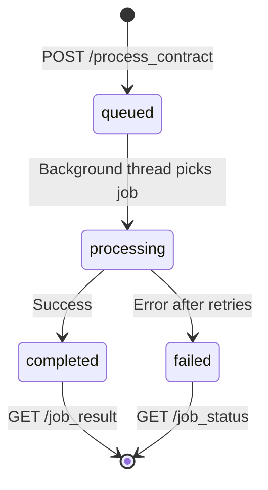

# Contract-Agent API Reference

**Version:** 1.0.0  
**Base URL:** Configurable (Development: `http://localhost:5002`, Production: AWS Elastic Beanstalk URL)  
**Protocol:** HTTP/HTTPS  
**Authentication:** None (to be implemented based on deployment environment)

---

## Table of Contents

1. [Overview](#overview)
2. [Request/Response Format](#requestresponse-format)
3. [Error Handling](#error-handling)
4. [Endpoints](#endpoints)
   - [Health & Status](#health--status)
   - [Contract Processing](#contract-processing)
   - [Job Management](#job-management)
   - [Debug & Monitoring](#debug--monitoring)
5. [Data Models](#data-models)
6. [Job Lifecycle](#job-lifecycle)
7. [Rate Limits & Constraints](#rate-limits--constraints)
8. [Integration Examples](#integration-examples)

---

## Overview

The Contract-Agent API provides endpoints for processing legal contract documents using AI-powered actor-critic pattern with AWS Bedrock and CrewAI integration. The API supports:

- **Asynchronous job processing** with status polling
- **Large document support** up to 200MB
- **Multiple file formats**: PDF, RTF, TXT
- **Natural language instructions** for contract modifications
- **Quality scoring and evaluation** metrics

### Key Features

- Actor-Critic AI workflow for intelligent contract processing
- Automatic document chunking for large files
- Retry logic with fallback model support
- Real-time progress tracking
- Comprehensive error handling and validation

---

## Request/Response Format

### Content Types

- **Request:** `multipart/form-data` (file uploads), `application/json` (JSON endpoints)
- **Response:** `application/json`

### Standard Response Envelope

All API responses include a `success` boolean field:

```json
{
  "success": true,
  "...": "additional fields"
}
```

### Timestamps

All timestamps are in ISO 8601 format (UTC):
```
"2025-10-02T08:26:29Z"
```

---

## Error Handling

### Error Response Format

All errors follow a consistent structure:

```json
{
  "success": false,
  "error": "Human-readable error message",
  "code": "MACHINE_READABLE_CODE"
}
```

### HTTP Status Codes

| Code | Meaning | Usage |
|------|---------|-------|
| `200` | OK | Request successful |
| `202` | Accepted | Job queued successfully |
| `400` | Bad Request | Invalid input parameters |
| `404` | Not Found | Resource (job) not found |
| `413` | Payload Too Large | File exceeds 200MB limit |
| `500` | Internal Server Error | Server-side processing error |

### Common Error Codes

- `NO_FILE_PROVIDED` - File missing in request
- `INVALID_FILE_TYPE` - Unsupported file format
- `NO_PROMPT_PROVIDED` - Modification instructions missing
- `INVALID_JOB_ID` - Malformed or invalid job ID
- `JOB_NOT_FOUND` - Job ID does not exist
- `PROCESSING_FAILED` - Contract processing error

---

## Endpoints

### Health & Status

#### `GET /` (Root Endpoint)
**Purpose:** Basic service information and health check (used by AWS Elastic Beanstalk)

**Request:**
```bash
GET /
```

**Response:** `200 OK`
```json
{
  "status": "healthy",
  "service": "Contract-Agent vNext",
  "message": "Contract Assistant API is running with CrewAI integration",
  "version": "1.0.0",
  "endpoints": [
    "/health",
    "/process_contract",
    "/job_status",
    "/job_result"
  ]
}
```

---

#### `GET /health`
**Purpose:** Detailed health check with component status

**Request:**
```bash
GET /health
```

**Response:** `200 OK` (Healthy)
```json
{
  "status": "healthy",
  "message": "Contract-Agent is running with CrewAI integration",
  "components": {
    "bedrock_available": true,
    "crewai_available": true,
    "processing_thread_active": true,
    "memory_storage_active": true
  },
  "queue_size": 2,
  "performance_metrics": {
    "total_jobs": 45,
    "successful_jobs": 43,
    "failed_jobs": 2,
    "average_processing_time": 52.7,
    "success_rate": 0.956
  },
  "timestamp": "2025-10-02T08:26:29Z"
}
```

**Response:** `500 Internal Server Error` (Unhealthy)
```json
{
  "status": "unhealthy",
  "message": "Health check failed: [error details]",
  "timestamp": "2025-10-02T08:26:29Z"
}
```

**Use Cases:**
- Liveness/readiness probes for container orchestration
- Client-side health monitoring
- Pre-flight checks before job submission

---

### Contract Processing

#### `POST /process_contract`
**Purpose:** Submit a contract document for AI-powered modification

**Request:**
- **Method:** `POST`
- **Content-Type:** `multipart/form-data`

**Form Parameters:**

| Parameter | Type | Required | Description |
|-----------|------|----------|-------------|
| `file` | File | Yes | Contract document (PDF, RTF, TXT) |
| `prompt` | String | Yes | Natural language modification instructions |

**Request Example:**
```bash
curl -X POST http://localhost:5002/process_contract \
  -F "file=@contract.pdf" \
  -F "prompt=Change jurisdiction from New York to Delaware and update governing law clauses"
```

**Validation Rules:**
- **File formats:** `.pdf`, `.txt`, `.rtf` only
- **File size:** Maximum 200MB
- **Prompt length:** Maximum 10,000 characters
- **Prompt content:** No script tags or malicious patterns

**Response:** `202 Accepted`
```json
{
  "job_id": "a1b2c3d4-e5f6-7890-abcd-ef1234567890",
  "status": "queued",
  "message": "Contract processing job queued successfully",
  "filename": "contract.pdf",
  "prompt": "Change jurisdiction from New York to Delaware...",
  "success": true
}
```

**Error Responses:**

`400 Bad Request` - Missing file:
```json
{
  "error": "No file provided",
  "success": false
}
```

`400 Bad Request` - Unsupported file type:
```json
{
  "error": "Unsupported file type: .docx. Supported: .pdf, .txt, .rtf",
  "success": false
}
```

`400 Bad Request` - Missing prompt:
```json
{
  "error": "No modification prompt provided",
  "success": false
}
```

`413 Payload Too Large`:
```json
{
  "error": "File too large. Maximum size is 200MB.",
  "success": false
}
```

**Processing Flow:**
1. File uploaded and validated
2. Job ID generated (UUID v4)
3. Job queued in background processing thread
4. `202 Accepted` returned immediately
5. Client polls `/job_status/{job_id}` for progress

---

### Job Management

#### `GET /job_status/{job_id}`
**Purpose:** Poll job processing status and progress

**Request:**
```bash
GET /job_status/a1b2c3d4-e5f6-7890-abcd-ef1234567890
```

**Path Parameters:**

| Parameter | Type | Description |
|-----------|------|-------------|
| `job_id` | UUID | Job identifier from `/process_contract` response |

**Response:** `200 OK` (Job in progress)
```json
{
  "job_id": "a1b2c3d4-e5f6-7890-abcd-ef1234567890",
  "status": "processing",
  "progress": 45,
  "message": "Job processing",
  "filename": "contract.pdf",
  "user_prompt": "Change jurisdiction from New York to Delaware...",
  "created_at": "2025-10-02T08:20:00Z",
  "updated_at": "2025-10-02T08:25:30Z",
  "success": true
}
```

**Response:** `200 OK` (Job completed - includes results)
```json
{
  "job_id": "a1b2c3d4-e5f6-7890-abcd-ef1234567890",
  "status": "completed",
  "progress": 100,
  "message": "Job completed",
  "filename": "contract.pdf",
  "user_prompt": "Change jurisdiction from New York to Delaware...",
  "created_at": "2025-10-02T08:20:00Z",
  "updated_at": "2025-10-02T08:26:15Z",
  "success": true,
  "final_rtf": "[Modified RTF content]",
  "iterations_used": 2,
  "processing_time": 52.7,
  "final_score": 0.85,
  "chunk_stats": {
    "total_chunks": 12,
    "modified_chunks": 7,
    "chunk_size": 25000
  }
}
```

**Response:** `200 OK` (Job failed)
```json
{
  "job_id": "a1b2c3d4-e5f6-7890-abcd-ef1234567890",
  "status": "failed",
  "progress": 0,
  "message": "Job failed",
  "filename": "contract.pdf",
  "user_prompt": "Change jurisdiction from New York to Delaware...",
  "created_at": "2025-10-02T08:20:00Z",
  "updated_at": "2025-10-02T08:21:30Z",
  "error_message": "Processing failed after 2 attempts: AWS Bedrock timeout",
  "success": true
}
```

**Error Responses:**

`400 Bad Request` - Invalid job ID:
```json
{
  "error": "Invalid job ID format",
  "success": false
}
```

`404 Not Found` - Job not found:
```json
{
  "error": "Job not found",
  "success": false
}
```

**Job Status Values:**
- `queued` - Job waiting in processing queue
- `processing` - Job actively being processed by AI
- `completed` - Job successfully completed
- `failed` - Job processing failed

**Progress Values:**
- `0` - Queued/Failed
- `10` - Processing started
- `30` - Text extraction complete
- `40-90` - AI processing iterations
- `100` - Completed

**Polling Recommendations:**
- Initial interval: 2 seconds
- Maximum interval: 10 seconds
- Use exponential backoff for production loads
- Stop polling when `status` is `completed` or `failed`

---

#### `GET /job_result/{job_id}`
**Purpose:** Retrieve complete results of a completed job with full RTF content

**Request:**
```bash
GET /job_result/a1b2c3d4-e5f6-7890-abcd-ef1234567890
```

**Path Parameters:**

| Parameter | Type | Description |
|-----------|------|-------------|
| `job_id` | UUID | Job identifier from `/process_contract` response |

**Response:** `200 OK` (Success)
```json
{
  "job_id": "a1b2c3d4-e5f6-7890-abcd-ef1234567890",
  "status": "completed",
  "filename": "contract.pdf",
  "user_prompt": "Change jurisdiction from New York to Delaware...",
  "processing_results": {
    "success": true,
    "final_rtf": "[Complete modified RTF document content]",
    "original_rtf": "[First 1000 chars of original]...",
    "iterations_used": 2,
    "total_processing_time": 52.7,
    "final_score": 0.85,
    "crew_output": "[CrewAI processing summary]...",
    "chunk_processing_stats": {
      "total_chunks": 12,
      "modified_chunks": 7,
      "chunk_size": 25000,
      "parallel_processing": true
    }
  },
  "created_at": "2025-10-02T08:20:00Z",
  "updated_at": "2025-10-02T08:26:15Z",
  "success": true
}
```

**Response:** `202 Accepted` (Job not completed yet)
```json
{
  "job_id": "a1b2c3d4-e5f6-7890-abcd-ef1234567890",
  "status": "processing",
  "progress": 67,
  "message": "Job not completed yet",
  "success": false
}
```

**Error Responses:**

`400 Bad Request` - Invalid job ID:
```json
{
  "error": "Invalid job ID format",
  "success": false
}
```

`404 Not Found` - Job not found:
```json
{
  "error": "Job not found",
  "success": false
}
```

`500 Internal Server Error` - Result missing:
```json
{
  "error": "Job completed but no result found",
  "success": false
}
```

**Important Notes:**
- This endpoint triggers **session-based cleanup** of job data after retrieval
- The `original_rtf` is truncated to first 1000 characters to reduce payload size
- The `crew_output` is truncated to first 500 characters
- Full `final_rtf` content is always included for completed jobs

---

### Debug & Monitoring

#### `GET /metrics`
**Purpose:** Performance metrics and statistics (Development/Monitoring)

**Request:**
```bash
GET /metrics
```

**Response:** `200 OK`
```json
{
  "success": true,
  "statistics": {
    "total_jobs": 150,
    "successful_jobs": 147,
    "failed_jobs": 3,
    "average_processing_time": 54.2,
    "median_processing_time": 48.5,
    "min_processing_time": 12.3,
    "max_processing_time": 185.7,
    "success_rate": 0.98,
    "average_quality_score": 0.853,
    "average_iterations": 1.8,
    "total_retries": 5
  },
  "recent_failures": [
    {
      "job_id": "xyz-123",
      "error": "Bedrock throttling",
      "timestamp": "2025-10-02T08:15:00Z"
    }
  ],
  "timestamp": "2025-10-02T08:26:29Z"
}
```

---

#### `GET /debug/queue`
**Purpose:** Debug endpoint for queue and thread status

**Request:**
```bash
GET /debug/queue
```

**Response:** `200 OK`
```json
{
  "queue_size": 3,
  "processing_thread_alive": true,
  "job_statistics": {
    "total_jobs": 45,
    "queued_jobs": 3,
    "processing_jobs": 1,
    "completed_jobs": 40,
    "failed_jobs": 1
  },
  "memory_storage_active": true,
  "timestamp": "2025-10-02T08:26:29Z"
}
```

**Use Cases:**
- Debugging stuck jobs
- Monitoring queue backlog
- Verifying thread health

---

#### `POST /debug/test_crewai`
**Purpose:** Test CrewAI workflow directly without file upload

**Request:**
```bash
curl -X POST http://localhost:5002/debug/test_crewai \
  -H "Content-Type: application/json" \
  -d '{
    "test_rtf": "This is a contract with ABC Corporation.",
    "test_prompt": "Change ABC Corporation to XYZ Limited"
  }'
```

**Request Body:**
```json
{
  "test_rtf": "Contract text to process",
  "test_prompt": "Modification instructions"
}
```

**Response:** `200 OK`
```json
{
  "test_successful": true,
  "result": {
    "final_rtf": "This is a contract with XYZ Limited.",
    "iterations_used": 1,
    "processing_time": 8.5,
    "final_score": 0.95,
    "error_message": null
  }
}
```

**Use Cases:**
- Quick API testing without file uploads
- Validating CrewAI workflow functionality
- Development and debugging

---

## Data Models

### Job Object

```typescript
{
  job_id: string (UUID v4),
  status: "queued" | "processing" | "completed" | "failed",
  progress: number (0-100),
  filename: string,
  user_prompt: string,
  created_at: string (ISO 8601),
  updated_at: string (ISO 8601),
  error_message?: string (only if failed)
}
```

### Processing Result Object

```typescript
{
  success: boolean,
  final_rtf: string | null,
  original_rtf: string (truncated),
  iterations_used: number,
  total_processing_time: number (seconds),
  final_score: number (0.0-1.0),
  crew_output: string (truncated),
  chunk_processing_stats?: {
    total_chunks: number,
    modified_chunks: number,
    chunk_size: number,
    parallel_processing: boolean
  }
}
```

### Health Status Object

```typescript
{
  status: "healthy" | "unhealthy",
  message: string,
  components: {
    bedrock_available: boolean,
    crewai_available: boolean,
    processing_thread_active: boolean,
    memory_storage_active: boolean
  },
  queue_size: number,
  performance_metrics: Statistics,
  timestamp: string (ISO 8601)
}
```

### Statistics Object

```typescript
{
  total_jobs: number,
  successful_jobs: number,
  failed_jobs: number,
  average_processing_time: number (seconds),
  median_processing_time: number (seconds),
  min_processing_time: number (seconds),
  max_processing_time: number (seconds),
  success_rate: number (0.0-1.0),
  average_quality_score: number (0.0-1.0),
  average_iterations: number,
  total_retries: number
}
```

---

## Job Lifecycle

### State Machine



### Typical Flow

1. **Submit Job**
   ```
   POST /process_contract
   → 202 Accepted {job_id: "..."}
   ```

2. **Poll Status** (repeat every 2-5 seconds)
   ```
   GET /job_status/{job_id}
   → 200 OK {status: "processing", progress: 45}
   ```

3. **Retrieve Results** (when status = "completed")
   ```
   GET /job_result/{job_id}
   → 200 OK {processing_results: {...}}
   ```

### Processing Timeline

| Stage | Progress | Duration (Typical) | Description |
|-------|----------|-------------------|-------------|
| Queued | 0% | 0-5s | Waiting in queue |
| Text Extraction | 10-30% | 1-3s | PDF/RTF text extraction |
| AI Processing | 30-90% | 10-120s | CrewAI actor-critic workflow |
| Finalization | 90-100% | 1-2s | Result storage and cleanup |

**Processing Time Estimates:**
- Small contracts (1-5KB): 10-20 seconds
- Medium contracts (5-20KB): 20-60 seconds
- Large contracts (50KB+): 60-180 seconds

---

## Rate Limits & Constraints

### File Constraints

| Limit | Value |
|-------|-------|
| Maximum file size | 200 MB |
| Supported formats | PDF, RTF, TXT |
| Maximum prompt length | 10,000 characters |

### Processing Constraints

| Limit | Value |
|-------|-------|
| Maximum iterations per job | 3 (configurable) |
| Job retry attempts | 2 |
| Chunk timeout | 300 seconds (5 minutes) |
| Quality threshold | 0.70 (70%) |
| Concurrent processing threads | 1 (single-threaded queue) |

### Rate Limiting

**Current Status:** Rate limiting is **disabled** for comprehensive testing.

**Planned Implementation:**
- Maximum 20 requests per hour per IP address
- `429 Too Many Requests` response when exceeded
- `Retry-After` header with cooldown period

---

## Integration Examples

### Python Example

```python
import requests
import time

# Configuration
BASE_URL = "http://localhost:5002"

# 1. Submit contract for processing
with open('contract.pdf', 'rb') as file:
    response = requests.post(
        f"{BASE_URL}/process_contract",
        files={'file': file},
        data={'prompt': 'Change jurisdiction to Delaware'}
    )

if response.status_code == 202:
    job_id = response.json()['job_id']
    print(f"Job submitted: {job_id}")
else:
    print(f"Error: {response.json()['error']}")
    exit(1)

# 2. Poll job status
while True:
    status_response = requests.get(f"{BASE_URL}/job_status/{job_id}")
    job_data = status_response.json()
    
    print(f"Status: {job_data['status']}, Progress: {job_data['progress']}%")
    
    if job_data['status'] == 'completed':
        print("Job completed successfully!")
        break
    elif job_data['status'] == 'failed':
        print(f"Job failed: {job_data['error_message']}")
        exit(1)
    
    time.sleep(3)  # Poll every 3 seconds

# 3. Retrieve results
result_response = requests.get(f"{BASE_URL}/job_result/{job_id}")
result = result_response.json()

print(f"Processing time: {result['processing_results']['total_processing_time']}s")
print(f"Quality score: {result['processing_results']['final_score']}")

# Save modified contract
with open('modified_contract.rtf', 'w') as f:
    f.write(result['processing_results']['final_rtf'])
```

### cURL Example

```bash
#!/bin/bash

# 1. Submit job
RESPONSE=$(curl -s -X POST http://localhost:5002/process_contract \
  -F "file=@contract.pdf" \
  -F "prompt=Change jurisdiction to Delaware")

JOB_ID=$(echo $RESPONSE | jq -r '.job_id')
echo "Job ID: $JOB_ID"

# 2. Poll status
while true; do
  STATUS=$(curl -s http://localhost:5002/job_status/$JOB_ID | jq -r '.status')
  echo "Status: $STATUS"
  
  if [ "$STATUS" = "completed" ] || [ "$STATUS" = "failed" ]; then
    break
  fi
  
  sleep 3
done

# 3. Get results
curl -s http://localhost:5002/job_result/$JOB_ID | jq '.'
```

### JavaScript/Node.js Example

```javascript
const FormData = require('form-data');
const fs = require('fs');
const axios = require('axios');

const BASE_URL = 'http://localhost:5002';

async function processContract(filePath, prompt) {
  // 1. Submit contract
  const formData = new FormData();
  formData.append('file', fs.createReadStream(filePath));
  formData.append('prompt', prompt);

  const submitResponse = await axios.post(
    `${BASE_URL}/process_contract`,
    formData,
    { headers: formData.getHeaders() }
  );

  const jobId = submitResponse.data.job_id;
  console.log(`Job submitted: ${jobId}`);

  // 2. Poll status
  while (true) {
    const statusResponse = await axios.get(
      `${BASE_URL}/job_status/${jobId}`
    );
    const { status, progress } = statusResponse.data;

    console.log(`Status: ${status}, Progress: ${progress}%`);

    if (status === 'completed') {
      break;
    } else if (status === 'failed') {
      throw new Error(statusResponse.data.error_message);
    }

    await new Promise(resolve => setTimeout(resolve, 3000));
  }

  // 3. Get results
  const resultResponse = await axios.get(
    `${BASE_URL}/job_result/${jobId}`
  );

  return resultResponse.data;
}

// Usage
processContract('contract.pdf', 'Change jurisdiction to Delaware')
  .then(result => {
    console.log('Processing complete!');
    console.log(`Time: ${result.processing_results.total_processing_time}s`);
    console.log(`Score: ${result.processing_results.final_score}`);
  })
  .catch(error => console.error('Error:', error.message));
```

---

## Best Practices

### Client Implementation

1. **Health Check First**
   - Always verify service health before submitting jobs
   - Check all components are available

2. **Exponential Backoff**
   - Start with 2-second polling interval
   - Increase to 5, 10 seconds for long-running jobs
   - Avoid excessive polling to reduce server load

3. **Error Handling**
   - Handle all HTTP status codes gracefully
   - Implement retry logic for transient failures (500, 503)
   - Parse and display error messages to users

4. **Timeout Management**
   - Set client timeout to at least 5 minutes for large documents
   - Implement job abandonment after reasonable wait (e.g., 10 minutes)

5. **Result Validation**
   - Verify `success` field in all responses
   - Check `final_score` against quality thresholds
   - Validate RTF content integrity before downstream use

6. **Memory Management**
   - Jobs are automatically cleaned up after result retrieval
   - Don't store large RTF content unnecessarily
   - Use streaming for very large documents if needed

### Security Considerations

1. **Input Validation**
   - API validates file types, sizes, and prompt content
   - Clients should pre-validate to reduce failed requests

2. **Job ID Security**
   - Job IDs are UUIDs (unguessable)
   - Validate format client-side before API calls
   - Don't expose job IDs in URLs for sensitive documents

3. **Transport Security**
   - Use HTTPS in production environments
   - Configure TLS 1.2+ for all API calls

4. **Credential Management**
   - API currently has no authentication (to be implemented)
   - Plan for token-based auth or federated identity

---

## Changelog

### Version 1.0.0 (Current)
- Initial API release
- Core endpoints: health, process_contract, job_status, job_result
- Support for PDF, RTF, TXT formats
- Actor-Critic AI workflow with AWS Bedrock
- Document chunking for large files
- Retry logic and error handling
- Performance monitoring and metrics

---

## Support & Contact

For issues, questions, or feature requests:
- Review the [SYSTEM_HANDOFF_GUIDE.md](../SYSTEM_HANDOFF_GUIDE.md) for operational details
- Check [TROUBLESHOOTING.md](./TROUBLESHOOTING.md) for common issues
- See [API_INTEGRATION_GUIDE.md](./API_INTEGRATION_GUIDE.md) for conceptual patterns

---

**Last Updated:** 2025-10-02  
**API Version:** 1.0.0  
**Status:** Production Ready ✅
