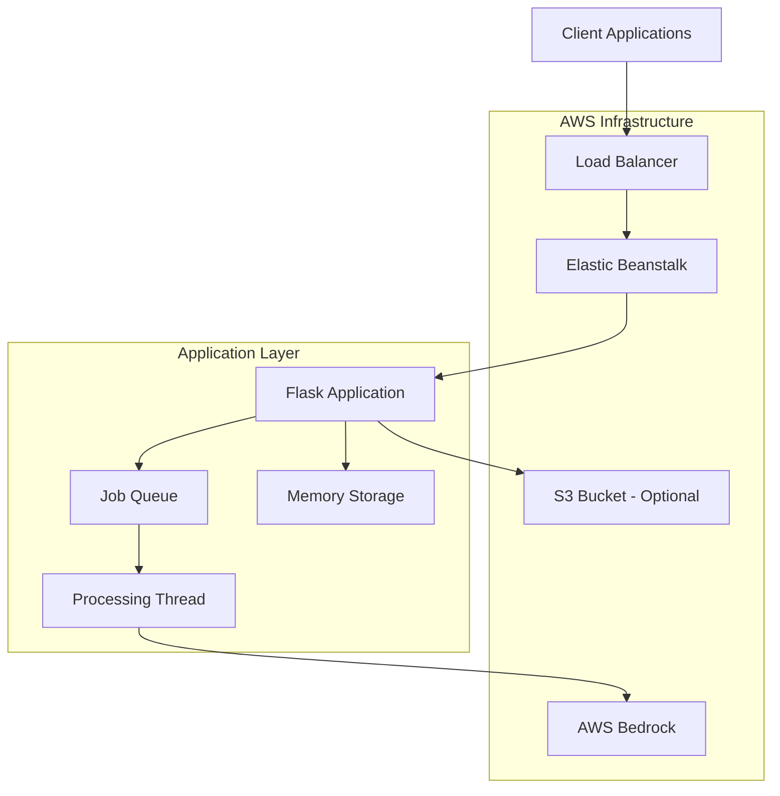

# CI/CD & DevOps Guide

**Version:** 1.0.0  
**Last Updated:** 2025-10-02

---

## Table of Contents

1. [Overview](#overview)
2. [Deployment Architecture](#deployment-architecture)
3. [AWS Elastic Beanstalk Deployment](#aws-elastic-beanstalk-deployment)
4. [CI/CD Pipeline](#cicd-pipeline)
5. [Docker Containerization](#docker-containerization)
6. [Infrastructure as Code](#infrastructure-as-code)
7. [Monitoring & Logging](#monitoring--logging)
8. [Backup & Disaster Recovery](#backup--disaster-recovery)
9. [Security & Compliance](#security--compliance)
10. [Troubleshooting](#troubleshooting)

---

## Overview

This guide covers deployment, continuous integration/continuous deployment (CI/CD), and DevOps practices for Contract-Agent.

### Current Deployment

- **Platform:** AWS Elastic Beanstalk
- **Environment:** Python 3.11 on Amazon Linux 2023
- **Instance Type:** t3.micro (can scale up)
- **Region:** us-east-1
- **Status:** Production Ready ✅

### Supported Deployment Options

1. **AWS Elastic Beanstalk** (Current, Recommended)
2. **Docker/Docker Compose** (Containerized)
3. **AWS ECS/Fargate** (Container orchestration)
4. **Kubernetes** (Advanced orchestration)
5. **Traditional VPS** (Manual setup)

---

## Deployment Architecture

### High-Level Architecture



### Component Dependencies

```
Internet
    ↓
Application Load Balancer (ALB)
    ↓
EC2 Instance (Elastic Beanstalk)
    ↓
Flask Application (app.py / application.py)
    ├── CrewAI Agents
    ├── Memory Storage
    └── Job Queue
        ↓
    AWS Bedrock (Nova Pro / Mistral Large)
```

---

## AWS Elastic Beanstalk Deployment

### Prerequisites

```bash
# Install EB CLI
pip install awsebcli

# Verify installation
eb --version
# Expected: EB CLI 3.20.x (Python 3.11)

# Configure AWS credentials
aws configure
# Or use IAM roles (recommended for production)
```

### Initial Deployment

#### Step 1: Initialize EB Application

```bash
cd /home/ec2-user/cb/Contract-Agent

# Initialize Elastic Beanstalk
eb init -p python-3.11 contract-agent --region us-east-1

# Follow prompts:
# - Application name: contract-agent
# - Platform: Python 3.11
# - SSH access: yes (for debugging)
```

#### Step 2: Create Environment

```bash
# Create production environment
eb create contract-agent-prod \
  --instance-type t3.small \
  --envvars AWS_REGION_NAME=us-east-1,CONTRACT_PRIMARY_MODEL=us.amazon.nova-pro-v1:0,CONTRACT_FALLBACK_MODEL=mistral.mistral-large-2402-v1:0 \
  --single

# For high availability (multiple instances):
eb create contract-agent-prod \
  --instance-type t3.small \
  --scale 2 \
  --envvars AWS_REGION_NAME=us-east-1,CONTRACT_PRIMARY_MODEL=us.amazon.nova-pro-v1:0
```

#### Step 3: Configure Environment Variables

```bash
# Set all required environment variables
eb setenv \
  AWS_REGION_NAME=us-east-1 \
  CONTRACT_PRIMARY_MODEL=us.amazon.nova-pro-v1:0 \
  CONTRACT_FALLBACK_MODEL=mistral.mistral-large-2402-v1:0 \
  ACTOR_MODEL=us.amazon.nova-pro-v1:0 \
  CRITIC_MODEL=us.amazon.nova-pro-v1:0 \
  FLASK_ENV=production \
  LOG_LEVEL=INFO

# Verify environment variables
eb printenv
```

#### Step 4: Deploy Application

```bash
# Deploy current code
eb deploy

# Monitor deployment
eb status
eb health

# View logs
eb logs
```

### Deployment Configuration Files

#### .ebignore

```bash
# .ebignore - Exclude files from deployment bundle
# Virtual environments
virt/
venv/
env/
__pycache__/
*.pyc
*.pyo

# Development files
.env
.env.local
app.py
*.md
.git/
.gitignore

# Test files
tests/
test_data/
evaluation_results/

# Generated files
data/uploads/*
data/generated/*
data/temp/*
logs/

# IDE
.vscode/
.idea/
*.swp
```

#### .elasticbeanstalk/config.yml

```yaml
branch-defaults:
  main:
    environment: contract-agent-prod
    group_suffix: null

global:
  application_name: contract-agent
  branch: null
  default_ec2_keyname: aws-eb-keypair
  default_platform: Python 3.11 running on 64bit Amazon Linux 2023
  default_region: us-east-1
  include_git_submodules: true
  instance_profile: null
  platform_name: null
  platform_version: null
  profile: null
  repository: null
  sc: git
  workspace_type: Application
```

### Environment Management

```bash
# List environments
eb list

# Switch environment
eb use contract-agent-staging

# Create staging environment
eb create contract-agent-staging --instance-type t3.micro

# Clone production to staging
eb clone contract-agent-prod -n contract-agent-staging

# Terminate environment
eb terminate contract-agent-staging
```

### Scaling

```bash
# Manual scaling
eb scale 3

# Auto-scaling configuration (via .ebextensions)
# Create .ebextensions/autoscaling.config
```

**.ebextensions/autoscaling.config:**

```yaml
option_settings:
  aws:autoscaling:asg:
    MinSize: 1
    MaxSize: 4
  aws:autoscaling:trigger:
    MeasureName: CPUUtilization
    Statistic: Average
    Unit: Percent
    UpperThreshold: 70
    LowerThreshold: 20
    UpperBreachScaleIncrement: 1
    LowerBreachScaleIncrement: -1
```

### Health Checks

**.ebextensions/healthcheck.config:**

```yaml
option_settings:
  aws:elasticbeanstalk:application:
    Application Healthcheck URL: /health
  aws:elasticbeanstalk:environment:process:default:
    HealthCheckPath: /health
    HealthCheckTimeout: 5
    HealthCheckInterval: 30
```

---

## CI/CD Pipeline

### GitHub Actions Workflow

Create `.github/workflows/deploy.yml`:

```yaml
name: Deploy to AWS Elastic Beanstalk

on:
  push:
    branches: [main, production]
  pull_request:
    branches: [main]

jobs:
  test:
    name: Run Tests
    runs-on: ubuntu-latest
    
    steps:
      - name: Checkout code
        uses: actions/checkout@v3
      
      - name: Set up Python 3.11
        uses: actions/setup-python@v4
        with:
          python-version: '3.11'
      
      - name: Install dependencies
        run: |
          python -m pip install --upgrade pip
          pip install -r requirements.txt
          pip install pytest pytest-cov
      
      - name: Run tests
        run: |
          python -m pytest tests/ -v --cov=core --cov=infrastructure
        env:
          AWS_REGION_NAME: us-east-1
      
      - name: Upload coverage reports
        uses: codecov/codecov-action@v3
        with:
          token: ${{ secrets.CODECOV_TOKEN }}
  
  deploy:
    name: Deploy to Elastic Beanstalk
    runs-on: ubuntu-latest
    needs: test
    if: github.ref == 'refs/heads/main'
    
    steps:
      - name: Checkout code
        uses: actions/checkout@v3
      
      - name: Install EB CLI
        run: |
          pip install awsebcli
      
      - name: Configure AWS credentials
        uses: aws-actions/configure-aws-credentials@v2
        with:
          aws-access-key-id: ${{ secrets.AWS_ACCESS_KEY_ID }}
          aws-secret-access-key: ${{ secrets.AWS_SECRET_ACCESS_KEY }}
          aws-region: us-east-1
      
      - name: Deploy to EB
        run: |
          eb init -p python-3.11 contract-agent --region us-east-1
          eb use contract-agent-prod
          eb deploy --staged
      
      - name: Verify deployment
        run: |
          # Wait for deployment to complete
          sleep 60
          # Test health endpoint
          HEALTH=$(curl -s https://your-app.elasticbeanstalk.com/health | jq -r '.status')
          if [ "$HEALTH" != "healthy" ]; then
            echo "Deployment health check failed"
            exit 1
          fi
```

### GitLab CI/CD

Create `.gitlab-ci.yml`:

```yaml
stages:
  - test
  - build
  - deploy

variables:
  AWS_DEFAULT_REGION: us-east-1
  EB_APPLICATION_NAME: contract-agent
  EB_ENVIRONMENT_NAME: contract-agent-prod

test:
  stage: test
  image: python:3.11
  script:
    - pip install -r requirements.txt
    - pip install pytest pytest-cov
    - python -m pytest tests/ -v --cov=core --cov=infrastructure
  coverage: '/TOTAL.*\s+(\d+%)$/'
  artifacts:
    reports:
      coverage_report:
        coverage_format: cobertura
        path: coverage.xml

deploy_production:
  stage: deploy
  image: python:3.11
  only:
    - main
  script:
    - pip install awsebcli
    - eb init -p python-3.11 $EB_APPLICATION_NAME --region $AWS_DEFAULT_REGION
    - eb use $EB_ENVIRONMENT_NAME
    - eb deploy
  environment:
    name: production
    url: https://your-app.elasticbeanstalk.com
```

### Deployment Checklist

Before deploying to production:

- [ ] All tests pass: `python -m pytest tests/ -v`
- [ ] LEDGAR evaluation successful: `python scripts/ledgar_evaluation_FIXED.py`
- [ ] Code review completed
- [ ] Environment variables configured
- [ ] Database migrations applied (if applicable)
- [ ] Backup created
- [ ] Deployment window scheduled
- [ ] Rollback plan documented
- [ ] Monitoring alerts configured

---

## Docker Containerization

### Dockerfile

Create `Dockerfile`:

```dockerfile
FROM python:3.11-slim

# Set working directory
WORKDIR /app

# Install system dependencies
RUN apt-get update && apt-get install -y \
    curl \
    && rm -rf /var/lib/apt/lists/*

# Copy requirements and install Python dependencies
COPY requirements.txt .
RUN pip install --no-cache-dir -r requirements.txt

# Copy application code
COPY . .

# Create data directories
RUN mkdir -p data/uploads data/generated data/temp

# Expose port
EXPOSE 5002

# Health check
HEALTHCHECK --interval=30s --timeout=3s --start-period=40s --retries=3 \
  CMD curl -f http://localhost:5002/health || exit 1

# Run application
CMD ["python", "application.py"]
```

### docker-compose.yml

```yaml
version: '3.8'

services:
  contract-agent:
    build: .
    image: contract-agent:latest
    ports:
      - "5002:5002"
    environment:
      - AWS_REGION_NAME=${AWS_REGION_NAME:-us-east-1}
      - CONTRACT_PRIMARY_MODEL=${CONTRACT_PRIMARY_MODEL}
      - CONTRACT_FALLBACK_MODEL=${CONTRACT_FALLBACK_MODEL}
      - ACTOR_MODEL=${ACTOR_MODEL}
      - CRITIC_MODEL=${CRITIC_MODEL}
      - FLASK_ENV=production
      - LOG_LEVEL=INFO
    volumes:
      - ./data:/app/data
      - ./logs:/app/logs
    restart: unless-stopped
    healthcheck:
      test: ["CMD", "curl", "-f", "http://localhost:5002/health"]
      interval: 30s
      timeout: 10s
      retries: 3
      start_period: 40s

  # Optional: nginx reverse proxy
  nginx:
    image: nginx:alpine
    ports:
      - "80:80"
      - "443:443"
    volumes:
      - ./nginx.conf:/etc/nginx/nginx.conf:ro
      - ./ssl:/etc/nginx/ssl:ro
    depends_on:
      - contract-agent
    restart: unless-stopped
```

### Building and Running

```bash
# Build Docker image
docker build -t contract-agent:latest .

# Run with docker-compose
docker-compose up -d

# View logs
docker-compose logs -f

# Scale instances
docker-compose up -d --scale contract-agent=3

# Stop services
docker-compose down
```

### Push to Container Registry

```bash
# AWS ECR
aws ecr create-repository --repository-name contract-agent
aws ecr get-login-password --region us-east-1 | docker login --username AWS --password-stdin <account-id>.dkr.ecr.us-east-1.amazonaws.com

docker tag contract-agent:latest <account-id>.dkr.ecr.us-east-1.amazonaws.com/contract-agent:latest
docker push <account-id>.dkr.ecr.us-east-1.amazonaws.com/contract-agent:latest

# Docker Hub
docker tag contract-agent:latest username/contract-agent:latest
docker push username/contract-agent:latest
```

---

## Infrastructure as Code

### Terraform Configuration

Create `infrastructure/terraform/main.tf`:

```hcl
terraform {
  required_providers {
    aws = {
      source  = "hashicorp/aws"
      version = "~> 5.0"
    }
  }
  
  backend "s3" {
    bucket = "contract-agent-terraform-state"
    key    = "production/terraform.tfstate"
    region = "us-east-1"
  }
}

provider "aws" {
  region = var.aws_region
}

# Elastic Beanstalk Application
resource "aws_elastic_beanstalk_application" "contract_agent" {
  name        = "contract-agent"
  description = "Contract-Agent AI Application"
}

# Elastic Beanstalk Environment
resource "aws_elastic_beanstalk_environment" "production" {
  name                = "contract-agent-prod"
  application         = aws_elastic_beanstalk_application.contract_agent.name
  solution_stack_name = "64bit Amazon Linux 2023 v4.0.0 running Python 3.11"
  
  setting {
    namespace = "aws:autoscaling:launchconfiguration"
    name      = "InstanceType"
    value     = var.instance_type
  }
  
  setting {
    namespace = "aws:autoscaling:asg"
    name      = "MinSize"
    value     = var.min_instances
  }
  
  setting {
    namespace = "aws:autoscaling:asg"
    name      = "MaxSize"
    value     = var.max_instances
  }
  
  setting {
    namespace = "aws:elasticbeanstalk:application:environment"
    name      = "AWS_REGION_NAME"
    value     = var.aws_region
  }
  
  setting {
    namespace = "aws:elasticbeanstalk:application:environment"
    name      = "CONTRACT_PRIMARY_MODEL"
    value     = var.primary_model
  }
  
  # Additional settings...
}

# IAM Role for EC2 instances
resource "aws_iam_role" "eb_ec2_role" {
  name = "contract-agent-eb-ec2-role"
  
  assume_role_policy = jsonencode({
    Version = "2012-10-17"
    Statement = [{
      Action = "sts:AssumeRole"
      Effect = "Allow"
      Principal = {
        Service = "ec2.amazonaws.com"
      }
    }]
  })
}

# Bedrock permissions
resource "aws_iam_role_policy" "bedrock_access" {
  name = "bedrock-access"
  role = aws_iam_role.eb_ec2_role.id
  
  policy = jsonencode({
    Version = "2012-10-17"
    Statement = [{
      Effect = "Allow"
      Action = [
        "bedrock:InvokeModel",
        "bedrock:InvokeModelWithResponseStream"
      ]
      Resource = "*"
    }]
  })
}
```

### Variables (`variables.tf`)

```hcl
variable "aws_region" {
  description = "AWS region"
  type        = string
  default     = "us-east-1"
}

variable "instance_type" {
  description = "EC2 instance type"
  type        = string
  default     = "t3.small"
}

variable "min_instances" {
  description = "Minimum number of instances"
  type        = number
  default     = 1
}

variable "max_instances" {
  description = "Maximum number of instances"
  type        = number
  default     = 4
}

variable "primary_model" {
  description = "Primary AI model"
  type        = string
  default     = "us.amazon.nova-pro-v1:0"
}
```

### Apply Infrastructure

```bash
cd infrastructure/terraform

# Initialize Terraform
terraform init

# Plan changes
terraform plan -out=tfplan

# Apply changes
terraform apply tfplan

# Destroy infrastructure
terraform destroy
```

---

## Monitoring & Logging

### CloudWatch Integration

**Metrics to Monitor:**
- CPU Utilization
- Memory Usage
- Request Count
- Response Time (Latency)
- Error Rate
- Job Queue Size

**CloudWatch Logs:**

```bash
# View EB logs
eb logs

# Stream logs
eb logs --stream

# Download all logs
eb logs --all
```

### Application Logging

**Structured Logging Setup:**

```python
import logging
import json
from datetime import datetime

# Configure logging
logging.basicConfig(
    level=logging.INFO,
    format='%(asctime)s - %(name)s - %(levelname)s - %(message)s',
    handlers=[
        logging.FileHandler('logs/app.log'),
        logging.StreamHandler()
    ]
)

logger = logging.getLogger(__name__)

# Structured log entries
def log_job_event(job_id, event_type, details):
    logger.info(json.dumps({
        'timestamp': datetime.utcnow().isoformat(),
        'job_id': job_id,
        'event_type': event_type,
        'details': details
    }))
```

### Custom Metrics

Create `.ebextensions/cloudwatch_metrics.config`:

```yaml
files:
  "/opt/aws/amazon-cloudwatch-agent/etc/amazon-cloudwatch-agent.json":
    mode: "000644"
    owner: root
    group: root
    content: |
      {
        "metrics": {
          "namespace": "ContractAgent",
          "metrics_collected": {
            "cpu": {
              "measurement": [
                {"name": "cpu_usage_active", "unit": "Percent"}
              ],
              "metrics_collection_interval": 60
            },
            "mem": {
              "measurement": [
                {"name": "mem_used_percent", "unit": "Percent"}
              ],
              "metrics_collection_interval": 60
            }
          }
        }
      }

commands:
  01_install_cloudwatch_agent:
    command: "sudo yum install -y amazon-cloudwatch-agent"
  02_start_cloudwatch_agent:
    command: "sudo /opt/aws/amazon-cloudwatch-agent/bin/amazon-cloudwatch-agent-ctl -a fetch-config -m ec2 -s -c file:/opt/aws/amazon-cloudwatch-agent/etc/amazon-cloudwatch-agent.json"
```

### Health Monitoring

```bash
# Check application health
curl https://your-app.elasticbeanstalk.com/health | jq '.'

# Monitor metrics
curl https://your-app.elasticbeanstalk.com/metrics | jq '.statistics'
```

---

## Backup & Disaster Recovery

### Data Backup Strategy

**What to Backup:**
- Application configuration
- Environment variables
- Test data and evaluation results
- Custom prompts and configurations

**Backup Script:**

```bash
#!/bin/bash
# backup.sh - Backup critical data

BACKUP_DIR="/backups/contract-agent/$(date +%Y%m%d_%H%M%S)"
mkdir -p "$BACKUP_DIR"

# Backup configuration
cp config/prompt_config.json "$BACKUP_DIR/"
cp .env.example "$BACKUP_DIR/"

# Backup test data
tar -czf "$BACKUP_DIR/test_data.tar.gz" data/test_data/

# Backup evaluation results
tar -czf "$BACKUP_DIR/evaluation_results.tar.gz" evaluation_results/

# Upload to S3
aws s3 sync "$BACKUP_DIR" s3://contract-agent-backups/$(date +%Y%m%d)/

echo "Backup completed: $BACKUP_DIR"
```

### Disaster Recovery Plan

**Recovery Time Objective (RTO):** < 1 hour  
**Recovery Point Objective (RPO):** < 24 hours

**Recovery Steps:**

1. **Deploy from backup:**
   ```bash
   # Restore from S3
   aws s3 sync s3://contract-agent-backups/latest/ ./restore/
   
   # Redeploy to EB
   eb deploy
   ```

2. **Verify functionality:**
   ```bash
   curl https://your-app.elasticbeanstalk.com/health
   python scripts/ledgar_evaluation_FIXED.py
   ```

3. **Update DNS (if needed):**
   ```bash
   # Update Route53 or DNS provider
   aws route53 change-resource-record-sets --hosted-zone-id Z123 --change-batch file://dns-update.json
   ```

---

## Security & Compliance

### Security Best Practices

1. **Use IAM Roles** instead of access keys in production
2. **Enable HTTPS** with SSL/TLS certificates
3. **Implement rate limiting** to prevent abuse
4. **Regular security audits** and penetration testing
5. **Keep dependencies updated** for security patches

### SSL/TLS Configuration

```bash
# Request ACM certificate
aws acm request-certificate \
  --domain-name contract-agent.yourdomain.com \
  --validation-method DNS

# Configure EB to use HTTPS
# Create .ebextensions/https.config
```

**.ebextensions/https.config:**

```yaml
option_settings:
  aws:elbv2:listener:443:
    Protocol: HTTPS
    SSLCertificateArns: arn:aws:acm:us-east-1:123456789012:certificate/abc123
    DefaultProcess: default
  aws:elasticbeanstalk:environment:process:default:
    Port: 5002
    Protocol: HTTP
```

### Secrets Management

```bash
# Store secrets in AWS Secrets Manager
aws secretsmanager create-secret \
  --name contract-agent/credentials \
  --secret-string '{"api_key":"xxx","db_password":"yyy"}'

# Retrieve in application
python -c "
import boto3
import json

client = boto3.client('secretsmanager', region_name='us-east-1')
response = client.get_secret_value(SecretId='contract-agent/credentials')
secrets = json.loads(response['SecretString'])
print(secrets)
"
```

---

## Troubleshooting

### Common Deployment Issues

#### Issue: Deployment fails with "502 Bad Gateway"

```bash
# Check application logs
eb logs

# Verify application starts correctly
eb ssh
sudo tail -f /var/log/web.stdout.log

# Common causes:
# - Port mismatch (ensure application.py uses correct port)
# - Missing dependencies
# - Configuration errors
```

#### Issue: Environment variables not loading

```bash
# Verify environment variables
eb printenv

# Set missing variables
eb setenv KEY=VALUE

# Restart application
eb restart
```

#### Issue: High memory usage

```bash
# Monitor instance metrics
eb health --refresh

# Scale up instance type
eb scale 1 --instance-type t3.medium

# Or implement cleanup
# Add to memory_storage.py scheduled cleanup
```

### Rollback Procedure

```bash
# List recent deployments
eb appversion

# Rollback to previous version
eb appversion -d

# Or specify version
eb deploy <version-label>
```

---

## Quick Reference

### Deployment Commands

```bash
# Initialize
eb init -p python-3.11 contract-agent --region us-east-1

# Create environment
eb create contract-agent-prod --instance-type t3.small

# Deploy
eb deploy

# Status
eb status
eb health

# Logs
eb logs
eb logs --stream

# Scale
eb scale 3

# Terminate
eb terminate contract-agent-prod
```

### Docker Commands

```bash
# Build
docker build -t contract-agent:latest .

# Run
docker run -p 5002:5002 --env-file .env contract-agent:latest

# Compose
docker-compose up -d
docker-compose logs -f
docker-compose down
```

---

**Last Updated:** 2025-10-02  
**Deployment Status:** Production Ready on AWS EB ✅

**Related Documentation:**
- [DEPLOYMENT.md](../deployment/DEPLOYMENT.md) - Detailed EB deployment
- [ENVIRONMENT_SETUP.md](./ENVIRONMENT_SETUP.md) - Environment configuration
- [SECURITY.md](./SECURITY.md) - Security best practices (TBD)
- [API_REFERENCE.md](./API_REFERENCE.md) - API documentation
