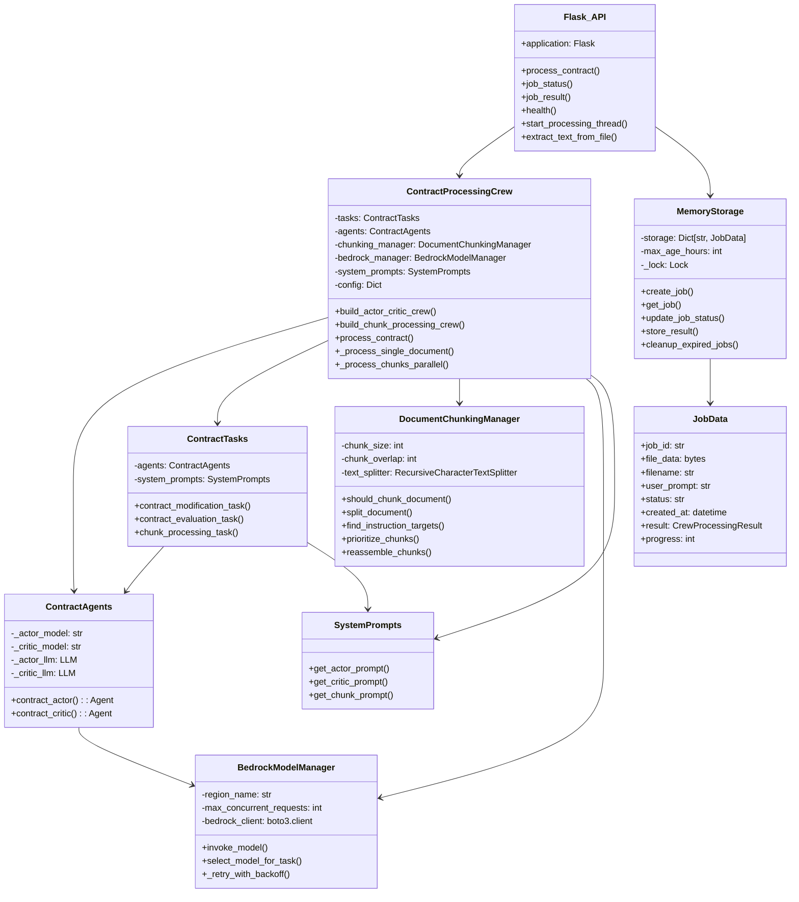
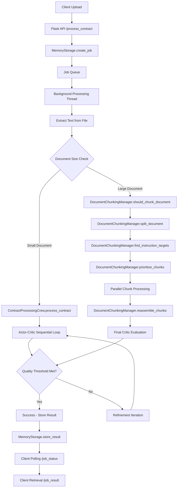
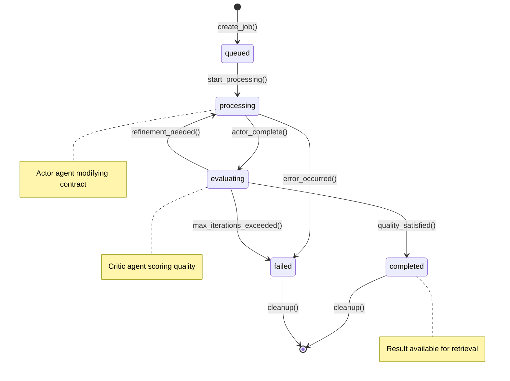
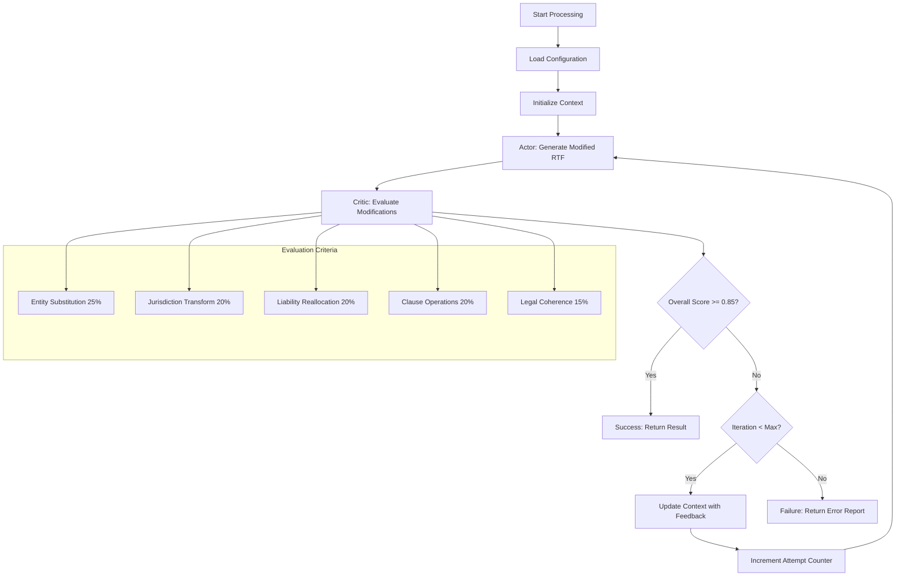

# Contract-Agent: Detailed Code Walkthrough and Architecture Diagrams

## Overview

This document provides a comprehensive code walkthrough of the Contract-Agent vNext system, including detailed Mermaid diagrams for component interactions, data flow, and processing workflows.

## System Components Analysis

### 1. Class Diagram - Component Relationships



### 2. Data Flow Diagram



### 3. Job State Machine



### 4. Detailed Chunked Processing Workflow

```mermaid
sequenceDiagram
    participant Client
    participant API as Flask API
    participant Queue as Job Queue
    participant Worker as Background Worker
    participant Crew as ContractProcessingCrew
    participant DCM as DocumentChunkingManager
    participant Pool as ThreadPool (max 5)
    participant Actor as Actor Agents
    participant Critic as Critic Agent
    participant Storage as MemoryStorage
    
    Client->>API: POST /process_contract (large file)
    API->>Storage: create_job()
    Storage-->>API: job_id
    API-->>Client: 202 Accepted {job_id}
    API->>Queue: enqueue job
    
    Queue->>Worker: get job from queue
    Worker->>Storage: update_job_status("processing", 10)
    Worker->>Worker: extract_text_from_file()
    Worker->>Storage: update_job_status("processing", 30)
    
    Worker->>Crew: process_contract()
    Crew->>DCM: should_chunk_document()
    DCM-->>Crew: true (large document)
    
    Crew->>DCM: split_document()
    DCM-->>Crew: chunks[]
    Crew->>DCM: find_instruction_targets()
    DCM-->>Crew: target_sections[]
    Crew->>DCM: prioritize_chunks()
    DCM-->>Crew: prioritized_chunks[]
    
    Crew->>Pool: submit chunk tasks (parallel, max 5)
    
    par Chunk 1
        Pool->>Actor: chunk_processing_task(chunk_1)
        Actor-->>Pool: processed_chunk_1
    and Chunk 2
        Pool->>Actor: chunk_processing_task(chunk_2)
        Actor-->>Pool: processed_chunk_2
    and Chunk N
        Pool->>Actor: chunk_processing_task(chunk_n)
        Actor-->>Pool: processed_chunk_n
    end
    
    Pool-->>Crew: all_processed_chunks[]
    Crew->>DCM: reassemble_chunks()
    DCM-->>Crew: final_document
    
    Crew->>Critic: contract_evaluation_task()
    Critic-->>Crew: evaluation_json
    Crew-->>Worker: CrewProcessingResult
    
    Worker->>Storage: store_result()
    Worker->>Storage: update_job_status("completed", 100)
    
    loop Client Polling
        Client->>API: GET /job_status/{job_id}
        API->>Storage: get_job()
        Storage-->>API: job_data
        API-->>Client: status_response
    end
    
    Client->>API: GET /job_result/{job_id}
    API->>Storage: get_result()
    Storage-->>API: result_data
    API-->>Client: final_result
```

### 5. Actor-Critic Feedback Loop Detail



## Code Analysis Summary

### Key Findings from Code Walkthrough:

1. **Modular Architecture**: Clean separation between API layer, orchestration, agents, and infrastructure
2. **Configurable Design**: All critical parameters externalized in config/prompt_config.json
3. **Robust Error Handling**: Comprehensive exception handling and graceful degradation
4. **Scalable Processing**: Parallel chunk processing with rate limiting (max 5 workers)
5. **Memory Management**: Thread-safe in-memory storage with configurable cleanup policies

### Critical Code Paths:

1. **Main Processing Flow**: `application.py` → `crew_manager.py` → `agents.py` → `bedrock_client.py`
2. **Chunking Pipeline**: `document_chunking.py` → parallel processing → reassembly
3. **Quality Control**: Actor-Critic loop with configurable thresholds and iteration limits
4. **Job Management**: `memory_storage.py` with thread-safe operations and automatic cleanup

### Configuration Dependencies:

- AWS Bedrock models (Titan Premier, Mistral Large)
- Environment variables for authentication and limits
- JSON configuration for prompts and evaluation criteria
- Dynamic chunk size and overlap settings

### Performance Considerations:

- Maximum file size: 200MB
- Chunk size: 25,000 characters with 5,000 overlap
- Concurrent requests: Limited to 5 (Bedrock rate limits)
- Processing timeout: 180 seconds per request
- Memory cleanup: Session-based or scheduled (48-hour retention)
