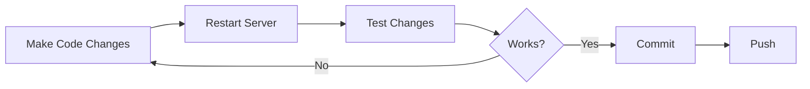

# Local Development Guide

**Version:** 1.0.0  
**Last Updated:** 2025-10-02

---

## Table of Contents

1. [Overview](#overview)
2. [Prerequisites](#prerequisites)
3. [Initial Setup](#initial-setup)
4. [Running the Application](#running-the-application)
5. [Development Workflow](#development-workflow)
6. [Project Structure](#project-structure)
7. [Development Tools](#development-tools)
8. [Common Tasks](#common-tasks)
9. [Debugging](#debugging)
10. [Best Practices](#best-practices)

---

## Overview

This guide helps you set up Contract-Agent for local development, from installation to running your first contract processing job.

**What You'll Learn:**
- Installing dependencies
- Configuring your development environment
- Running the application locally
- Making code changes safely
- Testing your changes

**Estimated Setup Time:** 15-30 minutes

---

## Prerequisites

### Required Software

| Software | Minimum Version | Recommended | Installation |
|----------|----------------|-------------|--------------|
| **Python** | 3.11+ | 3.11.x | [python.org](https://python.org) |
| **pip** | 23.0+ | Latest | Included with Python |
| **Git** | 2.30+ | Latest | [git-scm.com](https://git-scm.com) |
| **AWS CLI** | 2.0+ | Latest | [AWS Docs](https://aws.amazon.com/cli/) |

### Optional but Recommended

| Tool | Purpose | Installation |
|------|---------|--------------|
| **conda/miniconda** | Virtual environment management | [conda.io](https://conda.io) |
| **virtualenv** | Alternative to conda | `pip install virtualenv` |
| **jq** | JSON parsing for testing | OS package manager |
| **curl** | API testing | Usually pre-installed |
| **VSCode** | IDE with Python support | [code.visualstudio.com](https://code.visualstudio.com) |

### AWS Account Requirements

- Active AWS account with Bedrock access
- AWS credentials configured (see [ENVIRONMENT_SETUP.md](./ENVIRONMENT_SETUP.md))
- Bedrock model access granted for:
  - Amazon Nova Pro (`us.amazon.nova-pro-v1:0`)
  - Mistral Large (`mistral.mistral-large-2402-v1:0`)

---

## Initial Setup

### Step 1: Clone the Repository

```bash
# Clone the repository
cd /home/ec2-user/cb
git clone <repository-url> Contract-Agent
cd Contract-Agent

# Verify project structure
ls -la
# Should see: app.py, application.py, core/, docs/, requirements.txt, etc.
```

### Step 2: Create Virtual Environment

**Option A: Using Conda (Recommended)**

```bash
# Create conda environment
conda create -n contract-agent python=3.11
conda activate contract-agent

# Verify Python version
python --version
# Should output: Python 3.11.x
```

**Option B: Using venv**

```bash
# Create virtual environment
python3.11 -m venv venv

# Activate environment
# macOS/Linux:
source venv/bin/activate

# Windows:
venv\Scripts\activate

# Verify
which python
# Should point to virtual environment
```

### Step 3: Install Dependencies

```bash
# Ensure you're in the project root
cd /home/ec2-user/cb/Contract-Agent

# Install all dependencies
pip install -r requirements.txt

# Verify critical packages
pip list | grep -E "Flask|boto3|crewai|langchain"
```

**Expected Output:**
```
boto3                 1.34.0+
botocore              1.34.0+
crewai                0.40.0+
Flask                 3.0.0+
Flask-CORS            4.0.0+
langchain             0.1.0+
```

### Step 4: Configure AWS Credentials

**Option A: AWS CLI Configuration (Recommended for Development)**

```bash
# Configure AWS CLI
aws configure

# Enter your credentials when prompted:
# AWS Access Key ID: [Your Key]
# AWS Secret Access Key: [Your Secret]
# Default region name: us-east-1
# Default output format: json

# Verify connection
aws sts get-caller-identity
```

**Option B: Environment Variables**

```bash
# Create .env file (DON'T commit this!)
cat > .env << EOF
AWS_REGION_NAME=us-east-1
CONTRACT_PRIMARY_MODEL=us.amazon.nova-pro-v1:0
CONTRACT_FALLBACK_MODEL=mistral.mistral-large-2402-v1:0
ACTOR_MODEL=us.amazon.nova-pro-v1:0
CRITIC_MODEL=us.amazon.nova-pro-v1:0
PORT=5002
FLASK_ENV=development
LOG_LEVEL=DEBUG
EOF

# Ensure .env is in .gitignore
echo ".env" >> .gitignore
```

### Step 5: Verify AWS Bedrock Access

```bash
# Check if Bedrock is accessible
aws bedrock list-foundation-models --region us-east-1 | jq '.modelSummaries[] | select(.modelId | contains("nova-pro"))'

# Expected: JSON output with model details
# If error: You may need to request model access in AWS Console
```

**Grant Model Access:**
1. Go to AWS Console → Bedrock
2. Navigate to "Model access"
3. Request access for Amazon Nova Pro and Mistral Large
4. Wait for approval (usually instant for AWS models)

### Step 6: Create Required Directories

```bash
# Create data directories
mkdir -p data/uploads
mkdir -p data/generated
mkdir -p data/temp
mkdir -p logs

# Verify permissions
ls -ld data/*
# All should be writable
```

### Step 7: Verify Installation

```bash
# Run configuration validation
python -c "
from dotenv import load_dotenv
import os
load_dotenv()
print('✅ AWS Region:', os.getenv('AWS_REGION_NAME'))
print('✅ Primary Model:', os.getenv('CONTRACT_PRIMARY_MODEL'))
print('✅ Port:', os.getenv('PORT', '5002'))
"
```

---

## Running the Application

### Development Server

```bash
# Ensure virtual environment is activated
conda activate contract-agent  # or: source venv/bin/activate

# Start development server
python app.py
```

**Expected Output:**
```
🚀 Initializing Contract-Agent API Server...
✅ Configuration validation passed
📁 Upload folder: /home/ec2-user/cb/Contract-Agent/data/uploads
📁 RTF output folder: /home/ec2-user/cb/Contract-Agent/data/generated
🔥 Bedrock integration: True
🔄 Contract processing thread started
✅ Processing thread started: True
🌐 Contract-Agent API listening on port 5002
 * Running on http://0.0.0.0:5002
```

### Testing the Server

**Terminal 1 (Server):**
```bash
python app.py
```

**Terminal 2 (Client):**
```bash
# Test health endpoint
curl http://localhost:5002/health | jq '.'

# Expected response with "status": "healthy"
```

### Stopping the Server

```bash
# Press Ctrl+C in the terminal running app.py
^C
# Server will shut down gracefully
```

---

## Development Workflow

### Typical Development Cycle



### Making Code Changes

1. **Identify the component to modify:**
   - API endpoints → `app.py` or `application.py`
   - Agent logic → `core/agents/agents.py`
   - Workflow → `core/crew/crew_manager.py`
   - Document processing → `core/document_processing/`
   - Prompts → `core/prompts/system_prompts.py`

2. **Make your changes:**
   ```bash
   # Example: Modify agent behavior
   code core/agents/agents.py  # or vim, nano, etc.
   ```

3. **Restart the server:**
   ```bash
   # Stop server (Ctrl+C)
   # Start again
   python app.py
   ```

4. **Test your changes:**
   ```bash
   # Use curl or your test suite
   curl -X POST http://localhost:5002/process_contract \
     -F "file=@data/test_data/sample_01_converted.txt" \
     -F "prompt=Test modification"
   ```

### Hot Reload (Development Mode)

Flask supports auto-reload for development:

```bash
# Set Flask environment to development
export FLASK_ENV=development
export FLASK_DEBUG=1

# Run with auto-reload
python app.py
```

⚠️ **Note:** Auto-reload may not work with background threads. Manual restart is recommended for contract processing changes.

---

## Project Structure

Understanding the codebase layout:

```
Contract-Agent/
├── app.py                      # Development Flask server ⭐
├── application.py              # Production EB server
├── requirements.txt            # Python dependencies ⭐
├── .env                        # Environment config (DON'T commit!)
├── README.md                   # Project overview
├── SYSTEM_HANDOFF_GUIDE.md     # Operational guide
│
├── core/                       # Business Logic ⭐
│   ├── agents/
│   │   ├── agents.py          # Actor & Critic agents
│   │   └── tasks.py           # CrewAI task definitions
│   ├── crew/
│   │   └── crew_manager.py    # Main orchestration logic ⭐
│   ├── document_processing/
│   │   ├── document_chunking.py
│   │   └── pdf_utils.py
│   ├── prompts/
│   │   ├── system_prompts.py  # AI prompts
│   │   └── prompt_manager.py
│   └── utils/
│       └── monitoring.py      # Performance tracking
│
├── infrastructure/             # External Integrations
│   ├── aws/
│   │   └── bedrock_client.py  # AWS Bedrock connection ⭐
│   └── storage/
│       └── memory_storage.py  # Job storage
│
├── config/
│   └── prompt_config.json     # AI configuration ⭐
│
├── data/
│   ├── uploads/               # Uploaded contracts
│   ├── generated/             # Modified RTF output
│   ├── temp/                  # Temporary files
│   └── test_data/             # Test contracts ⭐
│
├── tests/                     # Test Suite ⭐
│   ├── test_api_server.py
│   ├── test_bedrock.py
│   ├── test_comprehensive_integration.py
│   └── ... (14 test files)
│
├── scripts/                   # Utility Scripts ⭐
│   ├── ledgar_evaluation_FIXED.py  # LEDGAR benchmark evaluation
│   ├── simple_test.py         # Quick testing
│   ├── test_fixed_version.py  # Version testing
│   └── examples/              # Example scripts
│
├── docs/                      # Documentation
│   ├── API_REFERENCE.md
│   ├── ENVIRONMENT_SETUP.md
│   ├── LOCAL_DEVELOPMENT.md
│   ├── TESTING_GUIDE.md
│   ├── CICD_DEVOPS_GUIDE.md
│   ├── TROUBLESHOOTING.md
│   ├── SECURITY.md
│   └── ... (additional docs)
│
└── evaluation_results/        # Test Results
    ├── nova-pro/
    └── mistral-large/
```

**⭐ = Frequently modified during development**

---

## Development Tools

### Recommended VSCode Extensions

```json
{
  "recommendations": [
    "ms-python.python",
    "ms-python.vscode-pylance",
    "ms-python.black-formatter",
    "ms-python.flake8",
    "ms-python.pylint",
    "redhat.vscode-yaml",
    "yzhang.markdown-all-in-one"
  ]
}
```

### Code Formatting

```bash
# Install formatters
pip install black flake8 pylint

# Format code
black .

# Check code style
flake8 core/ infrastructure/

# Lint code
pylint core/
```

### Interactive Testing with Python REPL

```python
# Start Python in project directory
python

# Import modules
from core.crew.crew_manager import ContractProcessingCrew
from infrastructure.aws.bedrock_client import BedrockModelManager

# Test components
crew = ContractProcessingCrew()
print(crew)

# Test Bedrock connection
bedrock = BedrockModelManager()
bedrock.test_connection()
```

### API Testing with curl

```bash
# Health check
curl http://localhost:5002/health | jq '.status'

# Submit test job
JOB_ID=$(curl -s -X POST http://localhost:5002/process_contract \
  -F "file=@data/test_data/sample_01_converted.txt" \
  -F "prompt=Test modification" | jq -r '.job_id')

echo "Job ID: $JOB_ID"

# Poll status
watch -n 2 "curl -s http://localhost:5002/job_status/$JOB_ID | jq '.status, .progress'"

# Get results
curl http://localhost:5002/job_result/$JOB_ID | jq '.processing_results.final_score'
```

---

## Common Tasks

### Running Tests

```bash
# Run all tests
python -m pytest tests/

# Run specific test file
python -m pytest tests/test_api_server.py -v

# Run with coverage
pip install pytest-cov
python -m pytest --cov=core --cov-report=html tests/
```

### Running LEDGAR Evaluation

```bash
# Full evaluation suite
python scripts/ledgar_evaluation_FIXED.py

# Results saved to evaluation_results/
ls -lh evaluation_results/
```

### Processing a Test Contract

```bash
# Quick test with sample contract
curl -X POST http://localhost:5002/process_contract \
  -F "file=@data/test_data/sample_01_converted.txt" \
  -F "prompt=Change jurisdiction to Delaware" \
  | jq '.'
```

### Viewing Logs

```bash
# Server logs (in terminal)
python app.py

# Or redirect to file
python app.py > logs/server.log 2>&1 &

# Tail logs
tail -f logs/server.log
```

### Cleaning Up Data Directories

```bash
# Clean uploaded files
rm -rf data/uploads/*

# Clean generated files
rm -rf data/generated/*

# Clean temp files
rm -rf data/temp/*

# Or use script
find data/ -type f -not -path "*/test_data/*" -delete
```

### Updating Dependencies

```bash
# Update requirements.txt after adding packages
pip freeze > requirements.txt

# Or manually edit requirements.txt and reinstall
pip install -r requirements.txt --upgrade
```

---

## Debugging

### Enable Debug Logging

```python
# In app.py, add at the top
import logging
logging.basicConfig(level=logging.DEBUG)
```

Or via environment:
```bash
export LOG_LEVEL=DEBUG
python app.py
```

### Common Debugging Scenarios

#### Issue: Server won't start

```bash
# Check port availability
lsof -i :5002
# If port is in use, kill the process or change PORT env var

# Check Python version
python --version
# Must be 3.11+

# Check dependencies
pip list | grep -E "Flask|boto3|crewai"
```

#### Issue: AWS connection fails

```bash
# Test AWS credentials
aws sts get-caller-identity

# Check Bedrock access
aws bedrock list-foundation-models --region us-east-1

# Verify environment variables
python -c "import os; from dotenv import load_dotenv; load_dotenv(); print(os.getenv('AWS_REGION_NAME'))"
```

#### Issue: Job stuck in queue

```bash
# Check processing thread
curl http://localhost:5002/debug/queue | jq '.processing_thread_alive'

# Check queue size
curl http://localhost:5002/debug/queue | jq '.queue_size'

# Restart server if thread is dead
```

#### Issue: Import errors

```bash
# Ensure you're in project root
pwd
# Should be: /home/ec2-user/cb/Contract-Agent

# Add to PYTHONPATH if needed
export PYTHONPATH="${PYTHONPATH}:/home/ec2-user/cb/Contract-Agent"
```

### Using Python Debugger (pdb)

```python
# Add breakpoint in your code
def process_contract(self, original_rtf, user_prompt, job_id):
    import pdb; pdb.set_trace()  # Debugger will pause here
    # ... rest of function
```

```bash
# Run server
python app.py

# When breakpoint hits, you'll get interactive prompt:
(Pdb) print(user_prompt)
(Pdb) next  # Next line
(Pdb) continue  # Resume
```

### VSCode Debugging

Create `.vscode/launch.json`:

```json
{
  "version": "0.2.0",
  "configurations": [
    {
      "name": "Python: Flask",
      "type": "python",
      "request": "launch",
      "module": "flask",
      "env": {
        "FLASK_APP": "app.py",
        "FLASK_ENV": "development"
      },
      "args": [
        "run",
        "--host=0.0.0.0",
        "--port=5002"
      ],
      "jinja": true
    }
  ]
}
```

---

## Best Practices

### Code Style

1. **Follow PEP 8** for Python code style
2. **Use type hints** for function signatures
3. **Write docstrings** for all functions and classes
4. **Keep functions small** (<50 lines when possible)
5. **Use meaningful variable names**

### Git Workflow

```bash
# Create feature branch
git checkout -b feature/your-feature-name

# Make changes and commit
git add .
git commit -m "feat: Add new feature description"

# Push to remote
git push origin feature/your-feature-name

# Create pull request
```

### Testing Changes

1. **Always test locally before committing**
2. **Run the test suite** before pushing
3. **Test with multiple contract sizes**
4. **Verify all endpoints still work**

### Environment Management

1. **Never commit `.env` files**
2. **Use `.env.example` for documentation**
3. **Keep credentials out of code**
4. **Document new environment variables**

### Performance Considerations

1. **Monitor memory usage** during development
2. **Profile slow operations** with cProfile
3. **Test with large files** (50KB+)
4. **Check for memory leaks** in long-running tests

---

## Troubleshooting Quick Reference

| Issue | Solution |
|-------|----------|
| Import errors | `export PYTHONPATH=/home/ec2-user/cb/Contract-Agent` |
| Port in use | Change `PORT` in .env or kill process |
| AWS connection fails | Run `aws configure` and verify credentials |
| Thread not starting | Check logs for errors, restart server |
| Tests failing | Ensure test data exists in `data/test_data/` |
| Slow processing | Check AWS Bedrock throttling limits |
| Memory leaks | Review job cleanup in memory_storage.py |

---

## Next Steps

After setup, you're ready to:

1. ✅ **Run your first contract processing job**
2. ✅ **Explore the codebase**
3. ✅ **Make your first code change**
4. ✅ **Run the test suite** (see [TESTING_GUIDE.md](./TESTING_GUIDE.md))
5. ✅ **Review API documentation** (see [API_REFERENCE.md](./API_REFERENCE.md))

---

## Quick Start Command Reference

```bash
# Setup
conda activate contract-agent
cd /home/ec2-user/cb/Contract-Agent

# Start server
python app.py

# Test server (new terminal)
curl http://localhost:5002/health

# Process test contract
curl -X POST http://localhost:5002/process_contract \
  -F "file=@data/test_data/sample_01_converted.txt" \
  -F "prompt=Change jurisdiction to Delaware"

# Run tests
python -m pytest tests/ -v

# Run evaluation
python scripts/ledgar_evaluation_FIXED.py
```

---

**Last Updated:** 2025-10-02  
**Status:** Ready for Development ✅

**Need Help?**
- [ENVIRONMENT_SETUP.md](./ENVIRONMENT_SETUP.md) - Configuration help
- [API_REFERENCE.md](./API_REFERENCE.md) - API documentation
- [TESTING_GUIDE.md](./TESTING_GUIDE.md) - Testing instructions
- [SYSTEM_HANDOFF_GUIDE.md](../SYSTEM_HANDOFF_GUIDE.md) - System overview
