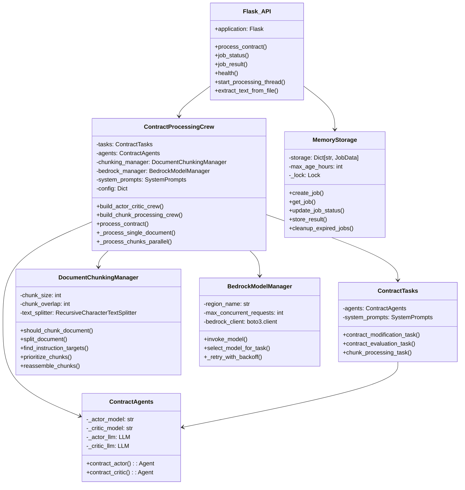
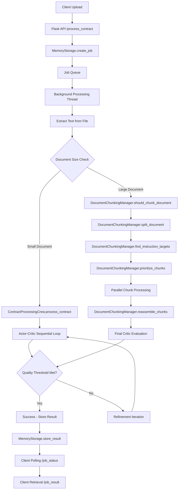
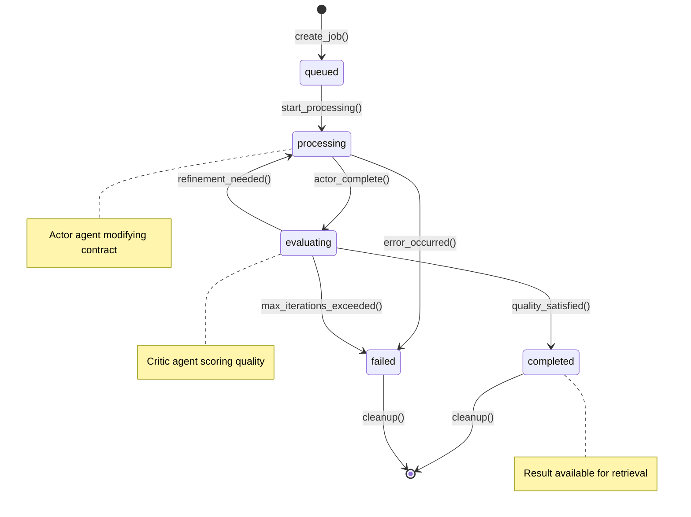
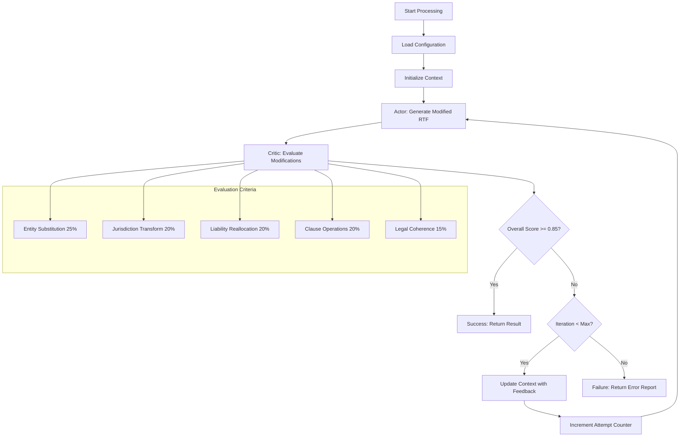

# Contract-Agent Mermaid Diagrams Collection

This document contains all Mermaid diagrams for the Contract-Agent system. Each diagram can be tested individually on https://mermaid.js.org/

## Instructions for Testing
1. Copy each diagram code block below
2. Go to https://mermaid.js.org/
3. Paste the code into the live editor
4. Verify the diagram renders correctly

---

## 1. High-Level System Architecture

```mermaid
graph TB
  subgraph Client (nxtApp)
    U[Upload file + instructions]
    P[Poll job status]
  end

  subgraph Contract-Agent Microservice
    A[Flask API: /process_contract, /job_status, /job_result, /health]
    M[MemoryStorage: jobs, progress, results]
    C[ContractProcessingCrew]
    AC[Actor Agent]
    CR[Critic Agent]
    DCM[DocumentChunkingManager]
    BRM[BedrockModelManager]
  end

  subgraph AWS Bedrock
    T[Titan Text Premier v1:0]
    ML[Mistral Large 2402 v1:0]
  end

  U --> A --> M
  A --> C
  C --> AC
  C --> CR
  C --> DCM
  AC --> BRM
  CR --> BRM
  BRM --> T
  BRM --> ML
  C --> M
  P --> A
```

---

## 2. Actor-Critic Workflow (Single Document)

```mermaid
sequenceDiagram
  participant API as API Server
  participant Crew as ContractProcessingCrew
  participant Actor as Actor Agent
  participant Critic as Critic Agent
  participant Bedrock as AWS Bedrock

  API->>Crew: process_contract(original_rtf, user_prompt)
  loop up to max_iterations (config)
    Crew->>Actor: contract_modification_task(context)
    Actor->>Bedrock: generate modified RTF
    Bedrock-->>Actor: modified RTF

    Crew->>Critic: contract_evaluation_task(context)
    Critic->>Bedrock: evaluate changes
    Bedrock-->>Critic: JSON evaluation

    Critic-->>Crew: overall_score, satisfied?
    alt satisfied == true
      break Success
    else score < threshold
      Crew->>Actor: iterate with feedback context
    end
  end
  Crew-->>API: CrewProcessingResult
```

---

## 3. Chunked Processing Workflow

```mermaid
sequenceDiagram
  participant API as API Server
  participant Crew as ContractProcessingCrew
  participant DCM as DocumentChunkingManager
  participant Worker as Parallel Actor Workers (<=5)
  participant Critic as Critic Agent

  API->>Crew: process_contract(original_rtf, user_prompt)
  Crew->>DCM: should_chunk_document()
  alt needs chunking
    Crew->>DCM: split_document()
    Crew->>DCM: find_instruction_targets(); prioritize_chunks()
    par up to 5 workers
      Crew->>Worker: chunk_processing_task(chunk_i)
      Worker-->>Crew: (processed_chunk_i, changed?)
    end
    Crew->>DCM: reassemble_chunks(processed_chunks)
    Crew->>Critic: contract_evaluation_task(final_rtf)
    Critic-->>Crew: evaluation JSON
    Crew-->>API: CrewProcessingResult
  else no chunking
    Crew->>Crew: fallback to single-document loop
  end
```

---

## 4. Detailed Class Diagram



---

## 5. Data Flow Diagram



---

## 6. Job State Machine



---

## 7. Actor-Critic Feedback Loop Detail



---

## Testing Instructions

To test these diagrams:

1. **Visit https://mermaid.js.org/**
2. **Click "Try it online" or go to the live editor**
3. **Clear the existing content**
4. **Copy and paste each diagram code block above**
5. **Verify the diagram renders correctly**
6. **Check for any syntax errors or rendering issues**

## Common Issues and Solutions

- **Syntax Errors**: Check for missing quotes, brackets, or semicolons
- **Rendering Issues**: Ensure proper spacing and indentation
- **Arrow Connections**: Verify all node references are correctly spelled
- **Subgraph Syntax**: Check subgraph closing braces and proper nesting

If any diagram fails to render, the syntax may need adjustment for the latest Mermaid version.
