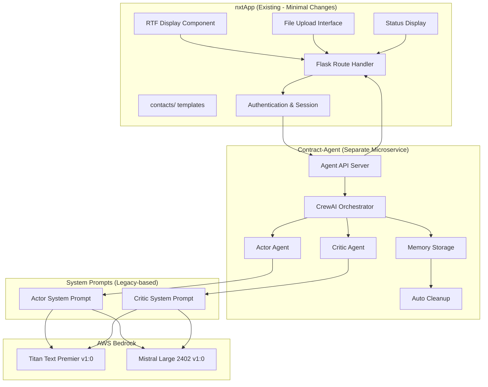

# Design Document

## Overview

The Contract Assistant vNext is a separate microservice (Contract-Agent) that communicates with the existing nxtApp through a well-defined API. The nxtApp handles file upload, user prompts, and RTF result display with minimal UI changes, while the Contract-Agent performs all processing using CrewAI framework and AWS Bedrock models (Titan Text Premier v1:0 or Mistral Large 2402 v1:0).

The system uses memory-based temporary storage with automatic cleanup after processing completion. The architecture ensures API synchronization between nxtApp and Contract-Agent for seamless integration.

Processing flow: nxtApp upload → API call to Contract-Agent → CrewAI actor-critic processing → RTF generation → API response to nxtApp → display results → cleanup temporary files.

## Architecture

### High-Level Architecture



### API Communication & Processing Flow

```mermaid
sequenceDiagram
    participant User
    participant nxtApp
    participant ContractAgent
    participant CrewAI
    participant Actor
    participant Critic
    participant Bedrock
    participant Memory
    
    User->>nxtApp: Upload PDF + Prompt
    nxtApp->>ContractAgent: POST /process_contract
    ContractAgent->>Memory: Store PDF temporarily
    ContractAgent->>CrewAI: Initialize Processing Crew
    ContractAgent->>nxtApp: Return job_id (202 Accepted)
    
    loop Actor-Critic Refinement (Max 5 iterations)
        CrewAI->>Actor: Create Contract Modification Task
        Actor->>Bedrock: Apply Semantic Manipulations
        Bedrock->>Actor: Return Modified RTF
        
        CrewAI->>Critic: Create Evaluation Task  
        Critic->>Bedrock: Evaluate Quality & Compliance
        Bedrock->>Critic: Return Evaluation Scores
        
        alt Quality Threshold Met (≥0.85)
            CrewAI->>Memory: Store Final RTF
            break Success - Exit Loop
        else Quality Below Threshold & Attempts < 5
            CrewAI->>Actor: Refine Based on Feedback
        else Max Attempts Reached
            CrewAI->>Memory: Mark as Failed
            break Failure - Exit Loop
        end
    end
    
    nxtApp->>ContractAgent: GET /job_status/{job_id}
    ContractAgent->>nxtApp: Return status + RTF (if complete)
    nxtApp->>User: Display RTF Results
    ContractAgent->>Memory: Auto-cleanup temporary files
```

## Components and Interfaces

### 1. Contract-Agent API Server

**Purpose:** Separate microservice handling all contract processing

**Key Responsibilities:**
- Provide REST API endpoints for nxtApp integration
- Manage temporary file storage in memory
- Coordinate CrewAI processing workflow
- Handle automatic cleanup after processing

**API Interface:**
```python
from flask import Flask, request, jsonify

class ContractAgentAPI:
    def __init__(self):
        self.app = Flask(__name__)
        self.memory_storage = MemoryStorage()
        self.crew_manager = CrewManager()
        self.setup_routes()
    
    # API Endpoints
    @app.route('/process_contract', methods=['POST'])
    def process_contract():
        # Handle file upload + prompt from nxtApp
        pass
    
    @app.route('/job_status/<job_id>', methods=['GET']) 
    def get_job_status(job_id):
        # Return processing status and results
        pass
    
    @app.route('/health', methods=['GET'])
    def health_check():
        # Health check for nxtApp monitoring
        pass
```

### 2. CrewAI Orchestrator

**Purpose:** Manages CrewAI agents within Contract-Agent microservice

**Key Responsibilities:**
- Initialize and manage CrewAI agents with legacy-based system prompts
- Coordinate actor-critic task execution
- Handle iteration loops and termination conditions
- Manage communication between agents

**Interface:**
```python
from crewai import Crew, Agent, Task

class ContractProcessingCrew:
    def __init__(self):
        self.actor_agent = self._create_actor_agent()
        self.critic_agent = self._create_critic_agent()
        self.crew = Crew(
            agents=[self.actor_agent, self.critic_agent],
            verbose=True,
            max_iterations=5
        )
    
    def process_contract(
        self, 
        original_rtf: str, 
        user_prompt: str, 
        job_id: str
    ) -> CrewProcessingResult
    
    def _create_actor_agent(self) -> Agent
    def _create_critic_agent(self) -> Agent
```

### 3. CrewAI Actor Agent (Legacy System Prompt Based with Chunking)

**Purpose:** Performs semantic contract manipulations using CrewAI Agent framework with legacy-derived system prompts and intelligent chunking

**Key Responsibilities:**
- Parse user instructions for semantic manipulations
- Handle document chunking for large contracts (>25,000 characters)
- Apply counterparty changes, domicile shifts, liability reallocations across chunks
- Perform clause additions, deletions, and modifications with context preservation
- Generate RTF output with proper formatting and chunk reassembly

**System Prompt (Enhanced from nxtChat Legacy):**
```python
ACTOR_SYSTEM_PROMPT = """You are a precise contract editor that modifies legal documents according to user instructions while preserving RTF formatting.

CHUNKING CONTEXT:
- You are processing chunk {chunk_id} of {total_chunks} of a document
- Some instructions may not apply to this specific chunk but to other parts of the document
- Return the FULL modified text for this chunk with ALL applicable changes implemented
- Maintain context awareness across chunk boundaries

Core requirements:
1. You MUST make ALL changes requested in the user's instructions - this is CRITICAL
2. You MUST maintain the EXACT RTF structure and formatting of the original document
3. ONLY modify the text content within RTF elements as specified in the instructions
4. NEVER add, remove, or modify RTF tags, attributes, or structure
5. Preserve ALL formatting elements: headings, paragraphs, styling, spacing
6. If there are MULTIPLE instructions, implement EACH ONE separately
7. Return the COMPLETE chunk with RTF formatting intact
8. Make ONLY the text changes specified - do not alter anything else

SEMANTIC MANIPULATION FOCUS:
- Counterparty name changes (replace all entity references)
- Legal domicile shifts (governing law, jurisdiction, venue changes)
- Liability reallocation (shift responsibility between parties)
- Clause operations (add, delete, modify specific clauses)

RTF FORMATTING RULES:
- Keep all RTF control words and formatting codes exactly as they are
- Maintain document structure, fonts, and styling
- Preserve line breaks, spacing, and document layout
- Only change the actual text content between RTF formatting codes
- If the input has RTF structure, your output must have the same RTF structure

IMPORTANT NOTES:
- Pay special attention to company names, addresses, dates, and monetary values
- Look for the specific text mentioned in the instruction and replace it EXACTLY as requested
- Instructions often specify entity names with quotes (e.g., from 'ABC Inc.' to 'XYZ Corp.')
- Maintain exact terminology from the original document for unchanged content
- If you can't find the exact text mentioned, look for similar text that matches the context
"""

class ContractActorAgent(Agent):
    def __init__(self):
        super().__init__(
            role="Contract Modification Specialist with Chunking Support",
            goal="Apply semantic manipulations to legal contracts with precision, handling large documents through intelligent chunking",
            backstory="Expert in legal document modification with deep understanding of contract law, RTF formatting, and document chunking strategies",
            llm=self._get_bedrock_model(),
            verbose=True,
            allow_delegation=False
        )
        self.chunking_manager = DocumentChunkingManager()
    
    def _get_bedrock_model(self):
        # Return configured Bedrock model (Nova Premier or Mistral Large)
        return BedrockLLM(
            model_id="amazon.nova-premier-v1:0:1000k",
            system_prompt=ACTOR_SYSTEM_PROMPT
        )
    
    def process_document(self, document: str, instruction: str) -> str:
        # Handle chunking logic for large documents
        if self.chunking_manager.should_chunk_document(document):
            return self._process_with_chunking(document, instruction)
        else:
            return self._process_single_chunk(document, instruction)
    
    def _process_with_chunking(self, document: str, instruction: str) -> str:
        # Split document and process chunks in parallel
        chunks = self.chunking_manager.split_document(document)
        targets = self.chunking_manager.find_instruction_targets(instruction, document)
        prioritized_chunks = self.chunking_manager.prioritize_chunks(chunks, targets)
        
        # Process chunks with parallel execution
        processed_chunks = self.chunking_manager.process_chunks_parallel(
            prioritized_chunks, instruction, self._process_single_chunk
        )
        
        # Reassemble final document
        return self.chunking_manager.reassemble_chunks(processed_chunks)
```

### 4. CrewAI Critic Agent (Legacy System Prompt Based)

**Purpose:** Evaluates actor modifications using CrewAI Agent framework with legacy-derived evaluation prompts

**Key Responsibilities:**
- Score modification quality against acceptance criteria
- Provide specific feedback for refinement
- Validate legal coherence and completeness
- Generate programmatic verification results

**System Prompt (Based on Experiment Framework):**
```python
CRITIC_SYSTEM_PROMPT = """You are a senior legal contract evaluator that assesses the quality and completeness of contract modifications.

Your role is to evaluate whether contract modifications meet the specified requirements and provide detailed feedback for improvement.

EVALUATION CRITERIA:
1. Entity Substitution Completeness (25% weight)
   - All entity name variations replaced correctly
   - Contact information updated consistently
   - Signature blocks and references updated

2. Jurisdiction Transformation Accuracy (20% weight)
   - Governing law clauses updated properly
   - Venue and dispute resolution clauses changed
   - All jurisdictional references consistent

3. Liability Reallocation Correctness (20% weight)
   - Liability clauses properly shifted between parties
   - Indemnification terms correctly reversed
   - Risk allocation updated as specified

4. Clause Operations Success (20% weight)
   - Required clauses added with correct text
   - Specified clauses deleted completely
   - Modified clauses updated properly

5. Legal Coherence Maintenance (15% weight)
   - Document maintains legal enforceability
   - No contradictory terms introduced
   - RTF formatting preserved correctly

SCORING REQUIREMENTS:
- Minimum acceptable score: 0.85 (85%)
- Provide specific scores for each criterion
- Identify unmet requirements clearly
- Suggest specific improvements for failed criteria

OUTPUT FORMAT:
Return a JSON evaluation with:
{
  "overall_score": 0.XX,
  "criteria_scores": {
    "entity_substitution": 0.XX,
    "jurisdiction_transformation": 0.XX,
    "liability_reallocation": 0.XX,
    "clause_operations": 0.XX,
    "legal_coherence": 0.XX
  },
  "satisfied": true/false,
  "unmet_criteria": ["list of failed criteria"],
  "feedback": "Specific improvement suggestions",
  "attempt_number": X
}
"""

class ContractCriticAgent(Agent):
    def __init__(self):
        super().__init__(
            role="Contract Quality Evaluator",
            goal="Evaluate contract modifications for accuracy and legal compliance with detailed scoring",
            backstory="Senior legal reviewer with expertise in contract analysis, quality assurance, and semantic manipulation validation",
            llm=self._get_bedrock_model(),
            verbose=True,
            allow_delegation=False
        )
    
    def _get_bedrock_model(self):
        return BedrockLLM(
            model_id="amazon.nova-premier-v1:0:1000k",
            system_prompt=CRITIC_SYSTEM_PROMPT
        )
```

### 5. Document Chunking Manager (Based on nxtChat)

**Purpose:** Handles intelligent document splitting and reassembly for large contracts

**Key Responsibilities:**
- Split large documents (>25,000 characters) into manageable chunks with overlap
- Identify target sections from user instructions for chunk prioritization
- Manage parallel processing of chunks with rate limiting
- Reassemble processed chunks maintaining document integrity

**Interface:**
```python
from langchain.text_splitter import RecursiveCharacterTextSplitter

class DocumentChunkingManager:
    def __init__(self):
        self.text_splitter = RecursiveCharacterTextSplitter(
            chunk_size=25000,
            chunk_overlap=5000,
            length_function=len,
            separators=["\n\n", "\n", " ", ""]
        )
    
    def should_chunk_document(self, document_content: str) -> bool:
        # Determine if document needs chunking
        return len(document_content) >= 25000
    
    def split_document(self, document_content: str) -> List[str]:
        # Split document into chunks
        return self.text_splitter.split_text(document_content)
    
    def find_instruction_targets(self, instruction: str, document: str) -> List[str]:
        # Identify target sections from user instructions (based on nxtChat)
        pass
    
    def prioritize_chunks(self, chunks: List[str], targets: List[str]) -> List[str]:
        # Prioritize chunks containing target sections (based on nxtChat)
        pass
    
    def process_chunks_parallel(
        self, 
        chunks: List[str], 
        instruction: str, 
        processor_func: callable
    ) -> List[Tuple[str, bool]]:
        # Process chunks in parallel with rate limiting
        pass
    
    def reassemble_chunks(self, processed_chunks: List[str]) -> str:
        # Reassemble processed chunks into final document
        pass

### 6. Memory Storage Manager

**Purpose:** Manages temporary file storage in memory with automatic cleanup

**Key Responsibilities:**
- Store uploaded PDF files temporarily in memory
- Manage processing results and intermediate data
- Automatic cleanup after processing completion
- Handle memory optimization for large documents

**Interface:**
```python
class MemoryStorage:
    def __init__(self):
        self.storage = {}  # In-memory storage
        self.cleanup_scheduler = CleanupScheduler()
    
    def store_file(self, job_id: str, file_data: bytes, filename: str) -> str:
        # Store file in memory with job_id key
        pass
    
    def get_file(self, job_id: str) -> bytes:
        # Retrieve file from memory
        pass
    
    def store_result(self, job_id: str, result_data: dict) -> None:
        # Store processing results
        pass
    
    def cleanup_job(self, job_id: str) -> None:
        # Remove all data for completed job
        pass
    
    def auto_cleanup(self, max_age_hours: int = 24) -> None:
        # Automatic cleanup of old jobs
        pass

### 7. Bedrock Model Manager

**Purpose:** Manages AWS Bedrock model selection and communication with chunking support

**Key Responsibilities:**
- Route requests to appropriate models (Titan Premier vs Mistral Large)
- Handle model-specific formatting and parameters for chunk processing
- Implement retry logic and error handling with rate limiting
- Manage model performance monitoring and parallel processing limits

**Interface:**
```python
class BedrockModelManager:
    def __init__(self):
        self.primary_model = "amazon.nova-premier-v1:0:1000k"
        self.fallback_model = "mistral.mistral-large-2402-v1:0"
        self.bedrock_client = boto3.client('bedrock-runtime')
        self.max_concurrent_requests = 5  # Rate limiting for Bedrock
    
    def get_model_for_task(self, task_type: str) -> str:
        # Select optimal model based on task complexity
        if task_type == "complex_semantic_manipulation":
            return self.primary_model
        else:
            return self.fallback_model
    
    def process_chunk(
        self, 
        chunk: str, 
        instruction: str, 
        chunk_id: str
    ) -> Tuple[str, bool]:
        # Process individual chunk with change detection (based on nxtChat)
        pass
    
    def invoke_model(
        self, 
        model_id: str, 
        prompt: str, 
        max_tokens: int = 4000
    ) -> BedrockResponse:
        # Call Bedrock with retry logic (based on legacy implementation)
        pass
```

### 7. RTF Display Component (Minimal nxtApp Changes)

**Purpose:** Renders RTF content dynamically in existing nxtApp frontend with minimal modifications

**Key Responsibilities:**
- Convert RTF to displayable HTML in existing contacts/ templates
- Provide download functionality for final RTF
- Show processing status from Contract-Agent API
- Integrate seamlessly with existing nxtApp UI patterns

**Interface:**
```javascript
// Minimal addition to existing nxtApp frontend
class RTFDisplayComponent {
    constructor(containerId) {
        this.container = document.getElementById(containerId);
        this.apiBaseUrl = '/api/contract-agent';  // Proxy to Contract-Agent
    }
    
    async uploadAndProcess(file, prompt) {
        // Upload to nxtApp, which forwards to Contract-Agent
        const formData = new FormData();
        formData.append('file', file);
        formData.append('prompt', prompt);
        
        const response = await fetch('/contract/process', {
            method: 'POST',
            body: formData
        });
        
        return response.json();
    }
    
    async pollStatus(jobId) {
        // Poll nxtApp endpoint which queries Contract-Agent
        const response = await fetch(`/contract/status/${jobId}`);
        return response.json();
    }
    
    renderRTF(rtfContent) {
        // Convert RTF to HTML and display in existing template
        // Use existing nxtApp styling and layout
    }
    
    downloadRTF(rtfContent, filename) {
        // Provide download functionality
        const blob = new Blob([rtfContent], { type: 'application/rtf' });
        const url = URL.createObjectURL(blob);
        const a = document.createElement('a');
        a.href = url;
        a.download = filename;
        a.click();
    }
}
```

### 8. nxtApp API Integration Layer

**Purpose:** Minimal API additions to nxtApp for Contract-Agent communication

**Key Responsibilities:**
- Proxy requests between frontend and Contract-Agent
- Handle authentication and session management
- Provide unified API interface for frontend
- Maintain existing nxtApp patterns

**Interface:**
```python
# Addition to existing nxtApp Flask routes
from flask import Blueprint, request, jsonify, session
import requests

contract_bp = Blueprint('contract', __name__)

@contract_bp.route('/contract/process', methods=['POST'])
def process_contract():
    """Proxy contract processing to Contract-Agent"""
    if 'user_id' not in session:
        return jsonify({'error': 'Authentication required'}), 401
    
    # Forward request to Contract-Agent
    files = {'file': request.files['file']}
    data = {
        'prompt': request.form.get('prompt'),
        'user_id': session['user_id']
    }
    
    response = requests.post(
        f"{CONTRACT_AGENT_URL}/process_contract",
        files=files,
        data=data
    )
    
    return response.json(), response.status_code

@contract_bp.route('/contract/status/<job_id>', methods=['GET'])
def get_contract_status(job_id):
    """Proxy status check to Contract-Agent"""
    response = requests.get(f"{CONTRACT_AGENT_URL}/job_status/{job_id}")
    return response.json(), response.status_code
```

## Data Models

### CrewAI Task Definitions

```python
from crewai import Task

class ContractModificationTask(Task):
    def __init__(self, original_rtf: str, user_prompt: str):
        super().__init__(
            description=f"""
            Apply the following semantic manipulations to the contract:
            {user_prompt}
            
            Original Contract (RTF):
            {original_rtf}
            
            Requirements:
            1. Change counterparty names as specified
            2. Shift legal domicile/governing law as requested
            3. Reallocate liability between parties as instructed
            4. Add, delete, or modify clauses as specified
            5. Maintain legal coherence and RTF formatting
            
            Output: Modified contract in RTF format
            """,
            expected_output="Complete RTF document with all requested modifications applied"
        )

class ContractEvaluationTask(Task):
    def __init__(self, original_rtf: str, modified_rtf: str, user_prompt: str):
        super().__init__(
            description=f"""
            Evaluate the quality of contract modifications against these criteria:
            
            Original Contract: {original_rtf[:500]}...
            Modified Contract: {modified_rtf[:500]}...
            User Requirements: {user_prompt}
            
            Evaluation Criteria:
            1. Entity substitution completeness (25%)
            2. Jurisdiction transformation accuracy (20%)
            3. Liability reallocation correctness (20%)
            4. Clause operations success (20%)
            5. Legal coherence maintenance (15%)
            
            Minimum acceptable score: 0.85
            """,
            expected_output="JSON evaluation with scores, feedback, and pass/fail determination"
        )
```

### Core Data Structures

```python
@dataclass
class CrewProcessingResult:
    success: bool
    job_id: str
    final_rtf: Optional[str]
    original_rtf: str
    iterations_used: int
    total_processing_time: float
    final_score: Optional[float]
    crew_output: str
    error_message: Optional[str]

@dataclass
class BedrockResponse:
    content: str
    model_id: str
    input_tokens: int
    output_tokens: int
    latency_ms: float
    
@dataclass
class RTFComparisonData:
    original_html: str
    modified_html: str
    changes_highlighted: str
    change_summary: List[str]
```

## Error Handling

### CrewAI-Specific Error Handling

1. **Agent Execution Errors**
   - Task failure handling within CrewAI framework
   - Agent communication timeouts
   - Model invocation failures
   - Response: Automatic retry with fallback model

2. **Bedrock Model Errors**
   - Rate limiting and throttling
   - Model unavailability
   - Token limit exceeded
   - Response: Model switching and request queuing

3. **Quality Threshold Failures**
   - Persistent low scores after 5 iterations
   - Critic agent evaluation failures
   - Response: Detailed failure report with retry option

### Error Recovery Implementation

```python
class CrewAIErrorHandler:
    def handle_agent_failure(self, agent: Agent, error: Exception) -> RecoveryAction:
        if isinstance(error, ModelTimeoutError):
            return RecoveryAction.SWITCH_MODEL
        elif isinstance(error, RateLimitError):
            return RecoveryAction.RETRY_WITH_DELAY
        else:
            return RecoveryAction.FAIL_GRACEFULLY
    
    def handle_task_failure(self, task: Task, attempt: int) -> RecoveryAction:
        if attempt < 3:
            return RecoveryAction.RETRY_TASK
        else:
            return RecoveryAction.ESCALATE_TO_HUMAN
```

## Testing Strategy

### CrewAI Integration Testing

1. **Agent Behavior Testing**
   - Actor agent semantic manipulation accuracy
   - Critic agent evaluation consistency
   - Inter-agent communication validation
   - Task execution flow verification

2. **Model Performance Testing**
   - Titan Premier vs Mistral Large comparison
   - Response time benchmarking
   - Quality score consistency
   - Token usage optimization

3. **End-to-End Workflow Testing**
   - Complete actor-critic loops
   - Iteration limit handling
   - Success/failure scenarios
   - Frontend integration validation

### Test Scenarios (Based on Existing Experiment Framework)

```python
TEST_SCENARIOS = [
    {
        "name": "counterparty_substitution",
        "prompt": "Change all references from 'Hash Blockchain Limited' to 'Digital Finance Corp'",
        "expected_manipulations": ["entity_substitution", "contact_updates"],
        "min_score": 0.85,
        "max_iterations": 3
    },
    {
        "name": "domicile_shift_singapore",
        "prompt": "Change governing law from Hong Kong to Singapore, update all jurisdictional references",
        "expected_manipulations": ["jurisdiction_change", "governing_law_update", "venue_change"],
        "min_score": 0.80,
        "max_iterations": 4
    },
    {
        "name": "liability_reallocation",
        "prompt": "Shift liability from company to client, reverse indemnification clauses",
        "expected_manipulations": ["liability_shift", "indemnification_reversal"],
        "min_score": 0.75,
        "max_iterations": 5
    }
]
```

## Performance Considerations

### Model Selection Strategy

1. **Primary Model: Titan Text Premier v1:0**
   - Optimized for complex legal document processing
   - Better performance on semantic manipulations
   - Higher token limits for large contracts

2. **Fallback Model: Mistral Large 2402 v1:0**
   - Faster response times for simple modifications
   - Cost-effective for high-volume processing
   - Reliable backup for Titan unavailability

3. **Dynamic Model Routing**
   ```python
   def select_model(prompt_complexity: float, document_length: int) -> str:
       if prompt_complexity > 0.7 or document_length > 10000:
           return "amazon.nova-premier-v1:0:1000k"
       else:
           return "mistral.mistral-large-2402-v1:0"
   ```

### CrewAI Optimization

1. **Agent Configuration**
   - Optimized agent roles and backstories
   - Efficient task delegation patterns
   - Memory management for large documents

2. **Iteration Control**
   - Early termination on quality threshold achievement
   - Progressive feedback refinement
   - Timeout handling for long-running tasks

## Integration Points

### Existing nxtApp Integration

1. **Frontend Templates (Minimal Changes)**
   - Extend existing `contacts/` templates for RTF display
   - Add RTF rendering JavaScript components
   - Integrate with existing Bootstrap/CSS framework
   - Maintain current navigation and layout patterns

2. **Backend Integration**
   - Add new Flask routes to existing blueprint structure
   - Leverage existing authentication and session management
   - Use existing DocumentStorage class for file handling
   - Extend database schema with new tables for job tracking

3. **Configuration Management**
   - External JSON configuration for CrewAI agents
   - Bedrock model configuration in existing config system
   - Environment-specific settings integration

### External Service Dependencies

1. **AWS Bedrock**
   - Titan Text Premier v1:0 and Mistral Large 2402 v1:0
   - Secure credential management via existing AWS integration
   - Regional deployment considerations

2. **CrewAI Framework**
   - Agent and task management
   - Built-in iteration and error handling
   - Integration with existing Python environment

### Deployment Architecture

1. **Separate Microservice Deployment**
   ```
   Contract-Agent/ (Separate microservice)
   ├── app.py                    # Flask API server
   ├── crew_manager.py           # CrewAI orchestration
   ├── memory_storage.py         # In-memory file management
   ├── bedrock_client.py         # AWS Bedrock integration
   ├── system_prompts.py         # Legacy-based prompts
   ├── requirements.txt          # Dependencies
   └── config/
       ├── agent_config.json     # CrewAI agent configuration
       └── model_config.json     # Bedrock model settings
   
   nxtApp/ (Existing - minimal changes)
   ├── nxtAppCore/
   │   ├── contract_proxy.py     # New: API proxy to Contract-Agent
   │   └── templates/contacts/
   │       └── contract_vnext.html  # New: RTF display template
   └── static/js/
       └── contract_rtf.js       # New: RTF handling component
   ```

2. **Dependencies**
   ```python
   # Contract-Agent requirements.txt
   flask>=2.3.0
   crewai>=0.28.0
   boto3>=1.34.0
   python-rtf>=1.0.0
   PyMuPDF>=1.23.0
   requests>=2.31.0
   
   # nxtApp additions (minimal)
   requests>=2.31.0  # For Contract-Agent communication
   ```

3. **Environment Variables**
   ```bash
   # Contract-Agent environment
   AWS_REGION=us-east-1
   AWS_ACCESS_KEY_ID=your_key
   AWS_SECRET_ACCESS_KEY=your_secret
   CONTRACT_PRIMARY_MODEL=amazon.nova-premier-v1:0:1000k
   CONTRACT_FALLBACK_MODEL=mistral.mistral-large-2402-v1:0
   CREWAI_MAX_ITERATIONS=5
   CREWAI_QUALITY_THRESHOLD=0.85
   MEMORY_CLEANUP_HOURS=24
   
   # nxtApp environment (addition)
   CONTRACT_AGENT_URL=http://contract-agent:5002
   ```

4. **API Synchronization Contract**
   ```yaml
   # API contract between nxtApp and Contract-Agent
   endpoints:
     - path: /process_contract
       method: POST
       request:
         files: {file: binary}
         data: {prompt: string, user_id: string}
       response: {job_id: string, status: string}
     
     - path: /job_status/{job_id}
       method: GET
       response: 
         status: string  # queued, processing, completed, failed
         progress: integer  # 0-100
         result_rtf: string  # if completed
         error_message: string  # if failed
     
     - path: /health
       method: GET
       response: {status: string, models_available: boolean}
   ```

5. **Memory Management Strategy**
   ```python
   # Contract-Agent memory configuration
   MEMORY_LIMITS = {
       'max_file_size_mb': 50,
       'max_concurrent_jobs': 10,
       'cleanup_interval_minutes': 60,
       'max_job_age_hours': 24
   }
   
   # Automatic cleanup implementation
   class MemoryCleanup:
       def __init__(self):
           self.scheduler = BackgroundScheduler()
           self.scheduler.add_job(
               self.cleanup_expired_jobs,
               'interval',
               minutes=MEMORY_LIMITS['cleanup_interval_minutes']
           )
   ```